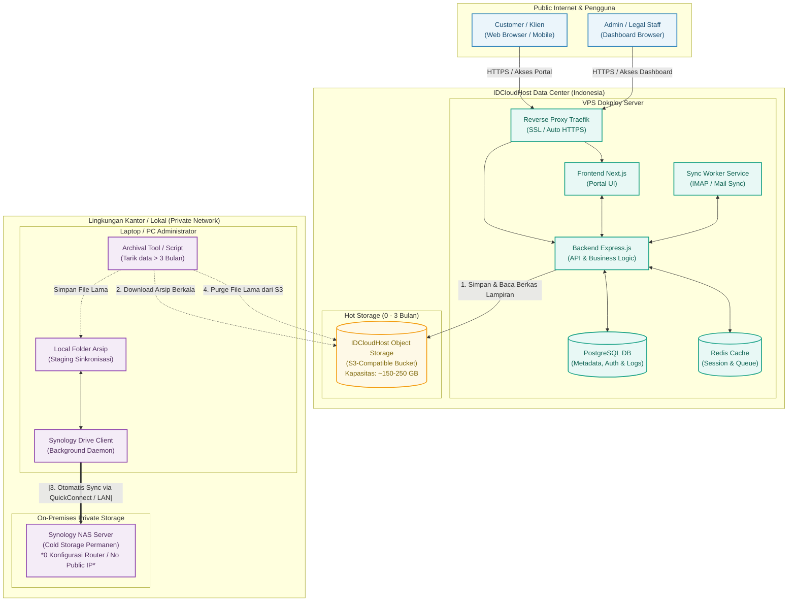
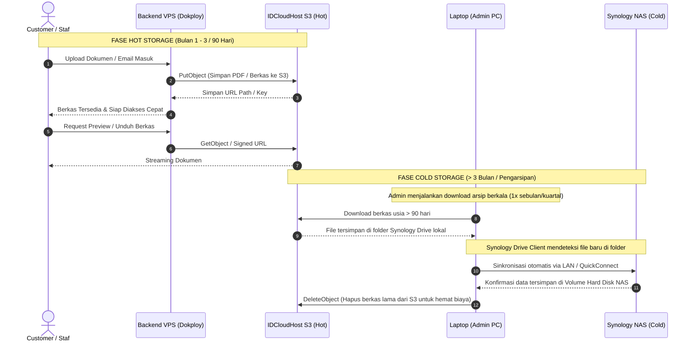

# Arsitektur Infrastruktur & Storage Lifecycle — Email Portal Customer

Dokumen ini menjelaskan arsitektur infrastruktur sistem **Email Portal Customer**, strategi penyimpanan **Hybrid Storage (Hot & Cold Storage)**, estimasi kapasitas serta alur data dari penerimaan dokumen hingga pengarsipan jangka panjang ke Synology NAS tanpa mengubah konfigurasi jaringan lokal kantor.

---

## 1. Ringkasan Eksekutif

| Parameter | Spesifikasi & Strategi |
|---|---|
| **Estimasi Beban** | 1.000 Customer / Bulan |
| **Hot Storage (Cloud)** | IDCloudHost Object Storage (S3-Compatible) |
| **Masa Retensi Hot Storage** | 3 Bulan (Rolling Window / Steady-State) |
| **Kapasitas Hot Storage Stabil** | ~150 GB – 250 GB |
| **Cold Storage (On-Premises)** | Synology NAS (Folder Arsip Dokumen Kantor) |
| **Jembatan Sinkronisasi (Bridge)** | Laptop Admin + Synology Drive Client (0 Konfigurasi di NAS/Router) |
| **Biaya Cloud Storage** | Flat ~Rp 80.000 – Rp 140.000 / bulan |
| **Platform Hosting** | Cloud VPS IDCloudHost (Dikelola via Dokploy) |

---

## 2. Diagram Arsitektur Infrastruktur (System Architecture)

Diagram berikut memetakan relasi antara pengguna, server VPS Dokploy di IDCloudHost, S3 Object Storage, dan Synology NAS lokal:

---

## 3. Diagram Alur Siklus Dokumen (Data Lifecycle)

Alur berkas dari saat diunggah customer, disimpan di Hot Storage S3 selama 90 hari, hingga diarsipkan ke NAS:

---

## 4. Rincian Komponen Infrastruktur

### A. Compute & Platform Layer (IDCloudHost VPS)
* **Dokploy PaaS**: Berfungsi sebagai orkestrator kontainer (Docker) mandiri di VPS untuk mengelola database, redis, backend, dan frontend secara otomatis.
* **Traefik Reverse Proxy**: Menangani routing domain (`mail.clienteasylegal.co.id`), rate limiting, dan auto-renewal sertifikat SSL Let's Encrypt.
* **Backend & Worker**: Menjalankan Node.js untuk menangani REST API, IMAP sync dengan Hostinger, dan adapter S3.
* **Database (PostgreSQL)**: Menyimpan metadata dokumen (nama file, hash, ukuran, relasi user, timestamp), bukan file fisik biner.

### B. Hot Storage Layer (IDCloudHost Object Storage S3)
* **Standard**: S3-Compatible API.
* **Fungsi**: Menyimpan berkas biner aktif (PDF kontrak, scan identitas, lampiran email).
* **Keunggulan**:
  * **Zero VPS Disk Bloat**: Hard disk SSD VPS tetap bersih dan tidak akan kehabisan ruang.
  * **Intranet Speed**: Karena VPS dan S3 berada di data center IDCloudHost yang sama, latensi transfer data sangat rendah (< 2 ms).
  * **High Availability**: Redundansi multi-node IDCloudHost memastikan file tidak hilang jika VPS mengalami restart/maintenance.

### C. Cold Storage Layer (Synology NAS & Drive Client)
* **Fungsi**: Arsip permanen jangka panjang untuk keperluan audit hukum dan retensi data bertahun-tahun.
* **Mekanisme Bridge**:
  * Menggunakan **Synology Drive Client** yang terpasang di komputer/laptop administrator.
  * Tidak memerlukan pembukaan port router (Port Forwarding), tidak memerlukan IP publik statis di kantor, dan tidak memerlukan instalasi aplikasi tambahan di DSM NAS.
  * Laptop bertindak sebagai agen transisi: file yang ditarik dari S3 langsung dimasukkan ke folder sinkronisasi Synology, lalu ditransfer ke NAS secara aman melalui jalur terenkripsi Synology QuickConnect atau WiFi LAN lokal.

---

## 5. Analisis Kapasitas & Estimasi Biaya

### Proyeksi Kapasitas (1.000 Pengguna / Bulan)

* **Rata-rata Dokumen**: ~15–20 berkas/dokumen per customer per bulan.
* **Rata-rata Ukuran Dokumen**: ~3 MB – 5 MB (gabungan surat teks, PDF resmi, dan lampiran scan).
* **Akumulasi per User**: ~75 MB / customer.

$$\text{Kebutuhan Bulanan} = 1.000 \times 75\text{ MB} = 75\text{ GB / Bulan}$$

Dengan kebijakan **Rolling Window 3 Bulan**:

$$\text{Steady-State Storage S3} = 75\text{ GB} \times 3 = \mathbf{225\text{ GB}}$$

### Estimasi Biaya Bulanan

| Komponen | Spesifikasi | Estimasi Biaya / Bulan |
|---|---|---|
| **Object Storage S3** | IDCloudHost (225 GB @ Rp 507/GB) | ~Rp 114.000 |
| **VPS Server (Dokploy)** | 2 vCPU, 4 GB RAM, 40-50 GB SSD | ~Rp 150.000 – Rp 200.000 |
| **Cold Storage (NAS)** | Synology Drive On-Premises | **Rp 0** (Hardware sudah dimiliki) |
| **Total Estimasi** | Infrastruktur Full Cloud + Hot Storage | **~Rp 264.000 – Rp 314.000 / bulan** |

> **Catatan:** Setelah bulan ke-3, tagihan Object Storage akan terkunci stabil (flat) karena dokumen lama yang berumur > 90 hari dipindahkan ke NAS dan dihapus dari S3.

---

## 6. Aspek Keamanan & Kepatuhan Regulasi

1. **Kedaulatan Data (UU Pelindungan Data Pribadi / PDP)**:
   * Seluruh data aktif tersimpan di pusat data lokal Indonesia (IDCloudHost Data Center).
2. **Isolasi Jaringan NAS Kantor**:
   * NAS kantor tidak dibuka ke internet publik, menghilangkan risiko serangan brute-force, ransomware, atau scanning port dari peretas luar.
3. **Enkripsi End-to-End**:
   * Komunikasi Web ke VPS: HTTPS (TLS 1.3).
   * Komunikasi VPS ke S3: S3 HTTPS API dengan Signature V4.
   * Komunikasi Laptop ke NAS: Enkripsi SSL bawaan Synology Drive Client.
