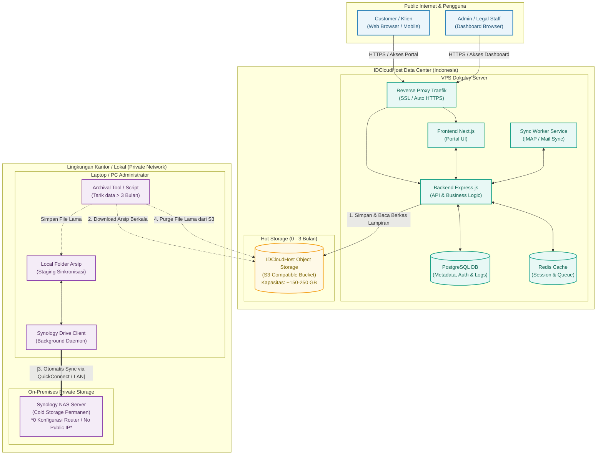
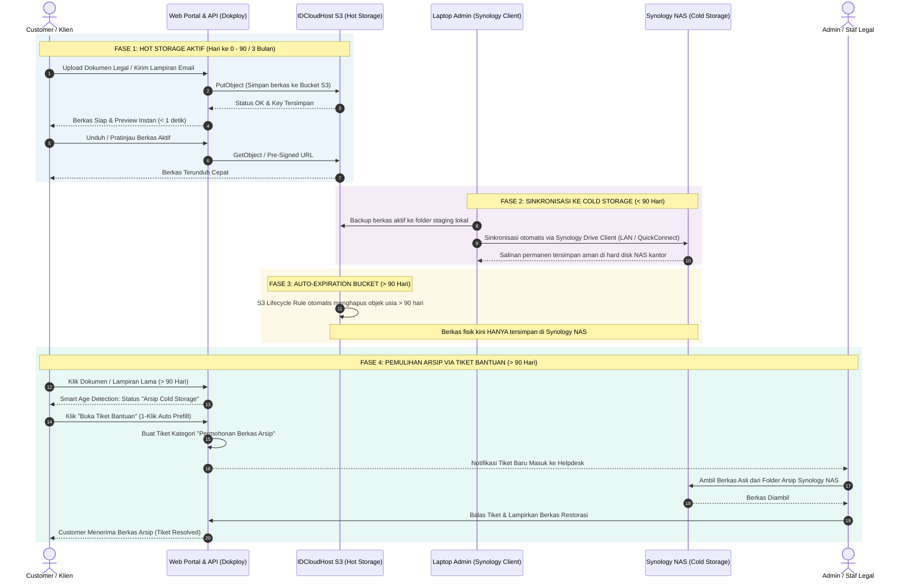

# Arsitektur Infrastruktur & Storage Lifecycle — Email Portal Customer

Dokumen ini menjelaskan arsitektur infrastruktur sistem **Email Portal Customer**, strategi penyimpanan **Hybrid Storage (Hot & Cold Storage)**, estimasi kapasitas serta alur data dari penerimaan dokumen hingga pengarsipan jangka panjang ke Synology NAS tanpa mengubah konfigurasi jaringan lokal kantor.

---

## 1. Ringkasan Eksekutif

| Parameter | Spesifikasi & Strategi |
|---|---|
| **Estimasi Beban** | 1.000 Customer / Bulan |
| **Hot Storage (Cloud)** | IDCloudHost Object Storage (S3-Compatible) |
| **Masa Retensi Hot Storage** | 3 Bulan (Rolling Window / Steady-State) |
| **Kapasitas Hot Storage Stabil** | ~150 GB – 250 GB |
| **Cold Storage (On-Premises)** | Synology NAS (Folder Arsip Dokumen Kantor) |
| **Jembatan Sinkronisasi (Bridge)** | Laptop Admin + Synology Drive Client (0 Konfigurasi di NAS/Router) |
| **Biaya Cloud Storage** | Flat ~Rp 80.000 – Rp 140.000 / bulan |
| **Platform Hosting** | Cloud VPS IDCloudHost (Dikelola via Dokploy) |

---

## 2. Diagram Arsitektur Infrastruktur (System Architecture)

Diagram berikut memetakan relasi antara pengguna, server VPS Dokploy di IDCloudHost, S3 Object Storage, dan Synology NAS lokal:



---

## 3. Diagram Alur Siklus Dokumen & Retensi (Data Lifecycle)

Alur berkas dari saat diunggah customer, disimpan di Hot Storage S3 selama 90 hari, otomatis dihapus oleh S3 Native Lifecycle, hingga mekanisme pemulihan berkas arsip dari Synology NAS melalui Tiket Bantuan:



---

## 4. Rincian Komponen Infrastruktur

### A. Compute & Platform Layer (IDCloudHost VPS)
* **Dokploy PaaS**: Berfungsi sebagai orkestrator kontainer (Docker) mandiri di VPS untuk mengelola database, redis, backend, dan frontend secara otomatis.
* **Traefik Reverse Proxy**: Menangani routing domain (`mail.clienteasylegal.co.id`), rate limiting, dan auto-renewal sertifikat SSL Let's Encrypt.
* **Backend & Worker**: Menjalankan Node.js untuk menangani REST API, IMAP sync dengan Hostinger, adapter S3, dan deteksi usia berkas (Smart Age Detection).
* **Database (PostgreSQL)**: Menyimpan metadata dokumen (nama file, hash, ukuran, relasi user, timestamp asli), bukan file fisik biner.

### B. Hot Storage Layer (IDCloudHost Object Storage S3)
* **Standard**: S3-Compatible API.
* **Fungsi**: Menyimpan berkas biner aktif (PDF kontrak, scan identitas, lampiran email) selama **maksimal 90 hari (3 bulan)**.
* **Keunggulan**:
  * **Zero VPS Disk Bloat**: Hard disk SSD VPS tetap bersih dan tidak akan kehabisan ruang.
  * **Intranet Speed**: Karena VPS dan S3 berada di data center IDCloudHost yang sama, latensi transfer data sangat rendah (< 2 ms).
  * **Auto Purge via Lifecycle**: Menggunakan Native S3 Lifecycle Rule untuk otomatis menghapus berkas > 90 hari tanpa membebani resource komputasi VPS.

### C. Cold Storage Layer (Synology NAS & Drive Client)
* **Fungsi**: Arsip permanen jangka panjang untuk keperluan audit hukum dan retensi data bertahun-tahun.
* **Mekanisme Bridge**:
  * Menggunakan **Synology Drive Client** yang terpasang di komputer/laptop administrator.
  * Tidak memerlukan pembukaan port router (Port Forwarding), tidak memerlukan IP publik statis di kantor, dan tidak memerlukan instalasi aplikasi tambahan di DSM NAS.
  * Laptop bertindak sebagai agen transisi: file yang ditarik dari S3 langsung dimasukkan ke folder sinkronisasi Synology, lalu ditransfer ke NAS secara aman melalui jalur terenkripsi Synology QuickConnect atau WiFi LAN lokal.

---

## 5. Analisis Kapasitas & Estimasi Biaya

### Proyeksi Kapasitas (1.000 Pengguna / Bulan)

* **Rata-rata Dokumen**: ~15–20 berkas/dokumen per customer per bulan.
* **Rata-rata Ukuran Dokumen**: ~3 MB – 5 MB (gabungan surat teks, PDF resmi, dan lampiran scan).
* **Akumulasi per User**: ~75 MB / customer.

$$\text{Kebutuhan Bulanan} = 1.000 \times 75\text{ MB} = 75\text{ GB / Bulan}$$

Dengan kebijakan **Rolling Window 3 Bulan**:

$$\text{Steady-State Storage S3} = 75\text{ GB} \times 3 = \mathbf{225\text{ GB}}$$

### Estimasi Biaya Bulanan

| Komponen | Spesifikasi | Estimasi Biaya / Bulan |
|---|---|---|
| **Object Storage S3** | IDCloudHost (225 GB @ Rp 507/GB) | ~Rp 114.000 |
| **VPS Server (Dokploy)** | 2 vCPU, 4 GB RAM, 40-50 GB SSD | ~Rp 150.000 – Rp 200.000 |
| **Cold Storage (NAS)** | Synology Drive On-Premises | **Rp 0** (Hardware sudah dimiliki) |
| **Total Estimasi** | Infrastruktur Full Cloud + Hot Storage | **~Rp 264.000 – Rp 314.000 / bulan** |

> **Catatan:** Setelah bulan ke-3, tagihan Object Storage akan terkunci stabil (flat) karena dokumen lama yang berumur > 90 hari dipindahkan ke NAS dan dihapus dari S3 oleh aturan lifecycle otomatis.

---

## 6. Aspek Keamanan & Kepatuhan Regulasi

1. **Kedaulatan Data (UU Pelindungan Data Pribadi / PDP)**:
   * Seluruh data aktif tersimpan di pusat data lokal Indonesia (IDCloudHost Data Center).
2. **Isolasi Jaringan NAS Kantor**:
   * NAS kantor tidak dibuka ke internet publik, menghilangkan risiko serangan brute-force, ransomware, atau scanning port dari peretas luar.
3. **Enkripsi End-to-End**:
   * Komunikasi Web ke VPS: HTTPS (TLS 1.3).
   * Komunikasi VPS ke S3: S3 HTTPS API dengan Signature V4.
   * Komunikasi Laptop ke NAS: Enkripsi SSL bawaan Synology Drive Client.

---

## 7. Kebijakan Retensi 3 Bulan & Integrasi Tiket Bantuan (Cold Storage Restore)

### 7.1 Kebijakan S3 Native Lifecycle Rule (90 Hari)
Bucket S3 IDCloudHost (`emailportal`) dikonfigurasi dengan aturan siklus hidup (lifecycle policy) resmi Ceph S3:
* **Target Bucket**: `emailportal`
* **Filter Prefix**: `attachments/` dan `documents/` (atau seluruh objek dalam bucket)
* **Status**: `Enabled`
* **Action**: `Expiration -> Days: 90`

#### Konfigurasi XML S3 Lifecycle:
```xml
<LifecycleConfiguration>
    <Rule>
        <ID>AutoExpireColdStorageAfter90Days</ID>
        <Filter>
            <Prefix></Prefix>
        </Filter>
        <Status>Enabled</Status>
        <Expiration>
            <Days>90</Days>
        </Expiration>
    </Rule>
</LifecycleConfiguration>
```
*Aturan ini dapat diaplikasikan melalui AWS CLI (`aws s3api put-bucket-lifecycle-configuration --endpoint-url https://is3.cloudhost.id`) atau menu S3 Management di Dokploy / Web Console IDCloudHost.*

---

### 7.2 Backend Smart Age Detection (Deteksi Usia Cerdas)
Untuk mencegah error `404 Not Found` saat customer mencoba mengunduh file yang sudah dibersihkan oleh S3 setelah 90 hari:

1. **Kalkulasi Usia Berkas**:
   ```typescript
   const RETENTION_DAYS = 90;
   const fileAgeInDays = Math.floor((Date.now() - new Date(fileRecord.createdAt).getTime()) / (1000 * 60 * 60 * 24));
   const isArchived = fileAgeInDays > RETENTION_DAYS;
   ```
2. **Respon Metadata Berkas**:
   Ketika API merespons daftar dokumen (`/api/documents`) atau detail lampiran email:
   ```json
   {
     "id": "doc_12345",
     "fileName": "Akta_Pendirian_PT.pdf",
     "fileSize": "2.4 MB",
     "createdAt": "2026-05-10T08:00:00.000Z",
     "fileAgeDays": 122,
     "isArchived": true,
     "storageTier": "COLD_STORAGE",
     "archiveLocation": "Synology NAS Kantor",
     "restoreAction": {
       "type": "OPEN_SUPPORT_TICKET",
       "targetUrl": "/support?action=restore_archive&documentId=doc_12345"
     }
   }
   ```
3. **Pencegahan Akses Langsung**:
   Jika endpoint `/api/documents/:id/download` dipanggil untuk file berusia > 90 hari, backend tidak akan memanggil S3 `GetObject`, melainkan mengembalikan response HTTP `410 Gone` atau `200 OK` dengan status terarah:
   `"Berkas telah dialihkan ke cold storage kantor. Silakan ajukan permohonan pemulihan melalui tiket bantuan."`

---

### 7.3 Pengalaman Pengguna (UI/UX) & 1-Klik Buka Tiket
Di portal frontend (`/documents` dan `/inbox`):

1. **Indikator Status (Badge)**:
   * Berkas < 90 hari: Badge hijau `"Tersedia di Cloud"` dengan tombol **Unduh** & **Pratinjau**.
   * Berkas > 90 hari: Badge amber/kuning `"Arsip Cold Storage (> 3 Bulan)"`.
2. **Tombol Tindakan 1-Klik**:
   * Tombol biasa otomatis berganti menjadi **"Minta Berkas (Tiket Bantuan)"**.
3. **Formulir Tiket Terisi Otomatis (*Pre-filled Ticket Form*)**:
   Saat tombol diklik, portal langsung membuka halaman Tiket Bantuan (`/support`) dengan field yang sudah otomatis terisi:
   * **Kategori**: `Permohonan File Arsip (Cold Storage)`
   * **Subjek**: `[Permohonan Berkas Arsip] Akta_Pendirian_PT.pdf`
   * **Prioritas**: `Sedang`
   * **Deskripsi Tiket**:
     ```text
     Halo Tim Support EasyLegal,

     Saya memerlukan salinan berkas yang telah melewati masa retensi 3 bulan berikut:
     - Nama Berkas: Akta_Pendirian_PT.pdf
     - ID Dokumen: doc_12345
     - Tanggal Unggah: 10 Mei 2026 (Usia: 122 hari)
     - Ukuran: 2.4 MB

     Mohon dibantu restorasi dari arsip Synology NAS kantor. Terima kasih.
     ```

---

### 7.4 Standard Operating Procedure (SOP) Admin: Pemulihan dari Synology NAS
1. **Penerimaan Tiket**: Staf Admin/Legal menerima notifikasi tiket baru di modul Helpdesk (`/support`).
2. **Pencarian Berkas di NAS**:
   * Admin membuka folder sinkronisasi Synology Drive di laptop/PC kantor:
     `D:\SynologyDrive\EasyLegal_ColdStorage\2026\05\doc_12345_Akta_Pendirian_PT.pdf`
3. **Pengiriman ke Customer**:
   * Admin mengunggah kembali file tersebut langsung ke kolom balasan tiket bantuan sebagai lampiran pemulihan resmi.
   * Admin mengirim pesan konfirmasi: *"Berkas Anda telah berhasil dipulihkan dari arsip Synology NAS kantor kami."*
4. **Penyelesaian Tiket**: Admin mengubah status tiket menjadi **Resolved**.
