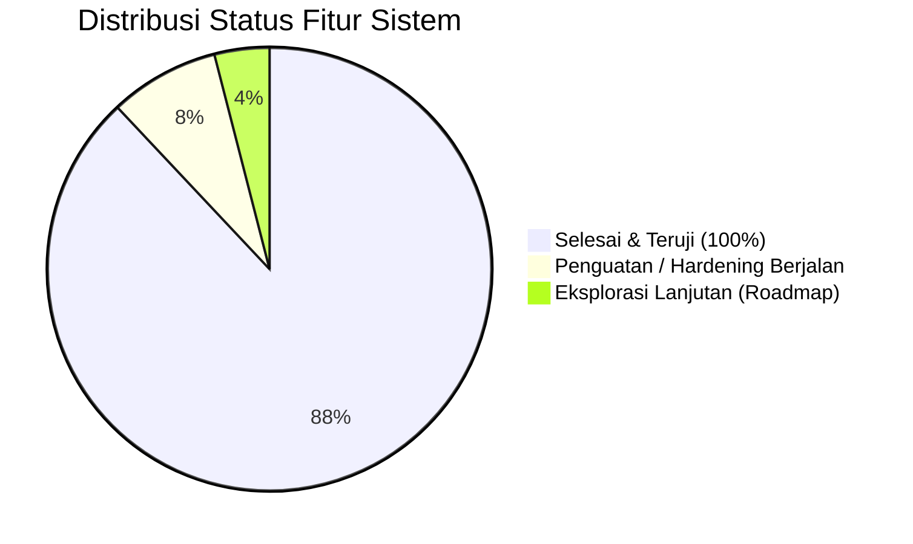

# 📊 Dokumen Status Pengerjaan Keseluruhan Fitur
**EasyLegal Hub & Customer Email Portal**  
*Update Terakhir: 9 September 2026*  
*Branch: `feat/ai-companion-el`*

---

## 📌 1. Ringkasan Eksekutif

Proyek **EasyLegal Customer Email Portal & Hub** saat ini telah mencapai status **Produksi Siap Uji (Production-Ready MVP+)** dengan seluruh modul inti telah selesai dikembangkan, diintegrasikan secara terpadu, dan diverifikasi melalui *automated testing* serta *production build*.

### 📈 Metrik Status Proyek

| Indikator | Capaian | Status |
|---|---|---|
| **Penyelesaian Fitur MVP (PRD)** | 24 dari 24 Requirement Fungsional (FR-01 s/d FR-24) | 🟢 **100% Selesai** |
| **Fitur Lanjutan (Extended Modules)** | Modul Drive, Helpdesk, Multi-IP Radar, AI El, Impersonation | 🟢 **100% Selesai** |
| **Penguatan Keamanan (Auth Hardening)** | RFC 6238 2FA TOTP, New Device Alert, AES-256-GCM | 🟢 **100% Selesai** |
| **Backend Test Suite (Jest)** | 18 dari 18 Test Suites Lulus (**118 / 118 Tests**) | 🟢 **100% Lulus** |
| **Frontend Test Suite (Jest)** | 5 dari 5 Test Suites Lulus (**24 / 24 Tests**) | 🟢 **100% Lulus** |
| **Kompilasi Frontend (Next.js)** | `npm run build` sukses tanpa error TypeScript / SSR | 🟢 **Siap Rilis** |
| **Sinkronisasi Git Remote** | Branch `feat/ai-companion-el` tersinkron ke GitHub | 🟢 **Up to Date** |

---

## 🧩 2. Matriks Status Pengerjaan Setiap Modul

### ✉️ Modul 1: EasyLegal Webmail Core (`/inbox`)
Menyediakan pengalaman email korporat modern berbasis domain Hostinger Titan Mail dengan UI minimalis Google-style.

| Fitur | Deskripsi Teknis | Status | Lokasi Kode |
|---|---|---|---|
| **Koneksi Titan IMAP & SMTP** | Autentikasi aman TLS/SSL, enkripsi kredensial AES-256-GCM, pengiriman via Hostinger direct SMTP. | 🟢 Selesai | `backend/src/routes/email.ts` `backend/src/lib/imap.ts` |
| **Navigasi Folder Mailbox** | Folder Inbox, Sent, Drafts, Trash, Spam dengan sinkronisasi counter pesan belum dibaca (*unread count*). | 🟢 Selesai | `frontend/src/app/inbox/page.tsx` |
| **Message Caching** | Sinkronisasi pesan berkala ke SQLite/PostgreSQL untuk pemuatan super cepat (< 1 detik). | 🟢 Selesai | `backend/src/workers/sync-worker.ts` `prisma/schema.prisma` |
| **Pembersihan Keamanan Email** | Sanitasi HTML DOMPurify (pencegahan XSS, blocking iframe, link hijacking). | 🟢 Selesai | `frontend/src/app/inbox/page.tsx` `shared/` |
| **Privasi Tracking Pixel** | Pemblokiran otomatis gambar pelacak eksternal dengan tombol toggle *"Tampilkan Gambar Asli"*. | 🟢 Selesai | `frontend/src/app/inbox/page.tsx` |
| **Rich Composer & Lampiran** | Editor tulis pesan, reply, forward, dengan dukungan multi-attachment hingga 10MB per pengiriman. | 🟢 Selesai | `frontend/src/app/inbox/page.tsx` |
| **Pencarian Email Cepat** | Pencarian instan berdasarkan subjek, pengirim, dan cuplikan badan email. | 🟢 Selesai | `backend/src/routes/search.ts` |
| **Tindakan Cepat (Actions)** | Bintang (Star), tandai dibaca/belum dibaca, hapus email (Trash). | 🟢 Selesai | `backend/src/routes/email.ts` |

---

### 📁 Modul 2: Legal Documents Drive (`/documents`)
Manajemen repositori berkas hukum korporasi dengan arsitektur penyimpanan ganda (*Dual & Hybrid Storage*).

| Fitur | Deskripsi Teknis | Status | Lokasi Kode |
|---|---|---|---|
| **Kategorisasi Dokumen Legal** | Pengelompokan: Akta Perusahaan, Kontrak/Perjanjian, Perpajakan, Perizinan, Dokumen Lainnya. | 🟢 Selesai | `frontend/src/app/documents/page.tsx` |
| **Interactive Document Preview** | Modal pratinjau dokumen dengan visualizer file, status berkas (CONFIDENTIAL / Urgent Review), dan timeline versi. | 🟢 Selesai | `frontend/src/components/documents/DocumentPreviewModal.tsx` |
| **Unified Storage Adapter** | Driver abstraksi penyimpanan: Hot Storage lokal (dev) dan S3 IDCloudHost (prod). | 🟢 Selesai | `backend/src/lib/storage-adapter.ts` |
| **Perhitungan Kuota 5GB** | Pemantauan kuota penyimpanan drive mailbox (5120 MB) terpisah dari kuota mail Hostinger. | 🟢 Selesai | `backend/src/routes/documents.ts` `backend/src/routes/settings.ts` |
| **Deteksi Usia Berkas (90 Hari)** | *Smart Age Detection*: Menandai dokumen berusia > 90 hari sebagai status Cold Storage secara otomatis. | 🟢 Selesai | `backend/src/routes/documents.ts` |
| **Pencegahan 404 & Cold Badge** | Blokir unduhan langsung file lewat 90 hari dan tampilkan badge *"Arsip Cold Storage (> 3 Bulan)"*. | 🟢 Selesai | `frontend/src/app/documents/page.tsx` |
| **1-Click Request Berkas** | Tombol *"Minta Berkas (Tiket Bantuan)"* yang mengisi otomatis formulir tiket `/support` dengan metadata dokumen. | 🟢 Selesai | `frontend/src/components/documents/DocumentPreviewModal.tsx` |

---

### 🎫 Modul 3: Support Helpdesk Center (`/support`)
Pusat komunikasi dan eskalasi bantuan pelanggan dengan SLA terukur.

| Fitur | Deskripsi Teknis | Status | Lokasi Kode |
|---|---|---|---|
| **Manajemen Tiket Bantuan** | Pembuatan tiket dengan ID otomatis unik (misal `#TK-8821`), subjek, kategori, dan prioritas. | 🟢 Selesai | `backend/src/routes/support.ts` |
| **Kategori Tiket Spesifik** | Kategori: Konsultasi Legal, Pemulihan Arsip Berkas (> 90 Hari), Layanan Akun, Kendala Teknis & Backend, Pertanyaan Umum. | 🟢 Selesai | `frontend/src/components/support/SupportTicketModal.tsx` |
| **Thread Percakapan Interaktif** | Bubble pesan pelanggan, bubble agen support, dan catatan internal staf (*Internal Notes*). | 🟢 Selesai | `frontend/src/app/support/page.tsx` |
| **Pemenuhan SLA Resmi** | Penanda batas SLA respons (maks. 1x24 jam kerja, atau < 4 jam untuk prioritas Urgent). | 🟢 Selesai | `frontend/src/components/support/SupportTicketModal.tsx` |
| **Penyelesaian Tiket (Resolved)** | Pelanggan atau admin dapat menandai tiket selesai dengan ringkasan solusi. | 🟢 Selesai | `backend/src/routes/support.ts` |
| **Accordion FAQ Interaktif** | Panduan bantuan cepat langsung di halaman helpdesk. | 🟢 Selesai | `frontend/src/app/support/page.tsx` |

---

### ⚙️ Modul 4: Pengaturan Akun & Profil (`/settings`)
Pusat kontrol preferensi, profil korporasi, dan pemantauan masa aktif pelanggan.

| Fitur | Deskripsi Teknis | Status | Lokasi Kode |
|---|---|---|---|
| **Profil & Avatar Korporasi** | Perubahan nama, email kontak, serta upload logo/avatar (maks 3MB, format PNG/JPG/WebP/SVG). | 🟢 Selesai | `backend/src/routes/settings.ts` `frontend/src/app/settings/page.tsx` |
| **Preferensi Bahasa & Timezone** | Pengaturan zona waktu (WIB, WITA, WIT) dan bahasa antarmuka. | 🟢 Selesai | `backend/src/routes/settings.ts` |
| **Rich Email Signature** | Pembuatan tanda tangan email profesional dengan pratinjau langsung. | 🟢 Selesai | `frontend/src/app/settings/page.tsx` |
| **Pemantauan Retensi 90 Hari** | Progress bar sisa hari aktif akun (90 hari) dengan banner peringatan otomatis (< 30 hari & < 7 hari). | 🟢 Selesai | `backend/src/routes/settings.ts` `frontend/src/app/settings/page.tsx` |
| **Ganti Kata Sandi Mandiri** | Validasi kompleksitas standar Hostinger (huruf besar, kecil, angka, simbol). | 🟢 Selesai | `backend/src/routes/auth.ts` |

---

### 🛡️ Modul 5: Keamanan & Autentikasi (*Security Core*)
Fondasi proteksi data dan kedaulatan akun hukum pelanggan.

| Fitur | Deskripsi Teknis | Status | Lokasi Kode |
|---|---|---|---|
| **Autentikasi 3-Tier RBAC** | Pemisahan izin peran: `CUSTOMER`, `OFFICER`, dan `ADMIN` / `SUPER_ADMIN`. | 🟢 Selesai | `backend/src/middleware/auth.ts` |
| **Enkripsi Kredensial AES-256-GCM** | Kredensial mailbox dan kunci 2FA dienkripsi menggunakan AES-GCM dengan random IV dan tag integritas. | 🟢 Selesai | `backend/src/lib/crypto.ts` |
| **Brute-Force Rate Limiting** | Pembatasan frekuensi percobaan login gagal untuk mencegah serangan kamus / brute-force. | 🟢 Selesai | `backend/src/routes/auth.ts` |
| **RFC 6238 TOTP Engine** | Mesin murni TOTP Base32 HMAC-SHA1 6-digit tanpa dependensi pihak ketiga dengan drift $\pm 30$ detik. | 🟢 Selesai | `backend/src/lib/totp.ts` |
| **Real 2FA Login Challenge** | Login dua tahap wajib (token tantangan 5 menit + validasi kode OTP 6-digit). | 🟢 Selesai | `backend/src/routes/auth.ts` `frontend/src/app/login/page.tsx` |
| **Modal Konfigurasi 2FA** | Modal QR code aktivasi TOTP (Google Authenticator/Authy) dan modal verifikasi sandi saat disable. | 🟢 Selesai | `frontend/src/app/settings/page.tsx` `backend/src/routes/security.ts` |
| **Deteksi Perangkat/IP Baru** | Sentinel pemeriksa riwayat login IP & User-Agent dengan pengiriman otomatis alert email ke `personalEmail`. | 🟢 Selesai | `backend/src/lib/security-alerts.ts` |
| **Pelacakan Sesi Aktif** | Audit perangkat yang sedang login (lokasi, IP, peramban) dan tombol darurat *Revoke All Other Sessions*. | 🟢 Selesai | `backend/src/routes/security.ts` |

---

### 🤖 Modul 6: AI Companion "El" (`/components/companion`)
Asisten cerdas interaktif pemandu ekosistem EasyLegal.

| Fitur | Deskripsi Teknis | Status | Lokasi Kode |
|---|---|---|---|
| **Avatar 3D Interaktif & Tilt** | Widget 3D dengan respons gerak mouse (*tilt effect*), animasi mata kedip, dan state emosi. | 🟢 Selesai | `frontend/src/components/companion/ElCharacter.tsx` `frontend/src/hooks/useTilt.ts` |
| **Balon Ajakan (Callout Badge)** | Balon interaktif mengambang: *"Ada kendala? Silakan kabari saya!"* untuk keterlibatan proaktif. | 🟢 Selesai | `frontend/src/components/companion/CompanionWidget.tsx` |
| **Proxy Backend 9router AI** | Proxy aman server-to-server ke 9router AI dengan batas waktu 35 detik dan parser tangguh SSE/JSON. | 🟢 Selesai | `backend/src/routes/companion.ts` |
| **Local Fallback Cerdas** | Basis pengetahuan lokal komprehensif saat jaringan AI eksternal offline / lambat. | 🟢 Selesai | `backend/src/lib/companion-knowledge.ts` |
| **Injeksi Data Live Akun** | Pemahaman kondisi akun live: sisa hari retensi, kuota storage MB & %, unread email, tiket aktif, 2FA. | 🟢 Selesai | `backend/src/routes/companion.ts` |
| **Pemahaman Sistem & Arsitektur** | Pengetahuan mendalam seputar website, Node.js/Express, IMAP Hostinger, Hybrid S3 & Synology. | 🟢 Selesai | `backend/src/lib/companion-knowledge.ts` |
| **Eskalasi Cepat Tiket Dukungan** | Deteksi kendala backend/500/database dengan tombol 1-klik buat tiket `Kendala Teknis & Backend`. | 🟢 Selesai | `frontend/src/components/companion/CompanionDialog.tsx` |

---

### 🎛️ Modul 7: Admin Console & Governance (`/admin`)
Panel manajemen pusat untuk administrator dan staf officer EasyLegal.

| Fitur | Deskripsi Teknis | Status | Lokasi Kode |
|---|---|---|---|
| **Provisioning Mailbox Hostinger** | Pembuatan akun email baru langsung ke Hostinger API lengkap dengan pengecekan kuota tersisa. | 🟢 Selesai | `backend/src/routes/mailboxes.ts` |
| **Officer 1-Click Impersonation** | Staf/Admin dapat masuk ke akun customer tanpa menanyakan password untuk mempermudah bantuan teknis. | 🟢 Selesai | `backend/src/routes/auth.ts` `frontend/src/app/auth/impersonate/` |
| **Top Banner Sesi Impersonasi** | Banner warna amber di header customer suite dengan tombol *"Keluar Sesi Impersonasi"*. | 🟢 Selesai | `frontend/src/components/layout/StaffImpersonationBanner.tsx` |
| **Multi-IP Security Radar** | Monitor real-time sesi login mencurigakan dari IP/lokasi berbeda dalam 24 jam untuk Super Admin. | 🟢 Selesai | `backend/src/routes/security.ts` `frontend/src/app/admin/page.tsx` |
| **Master Storage Inspector** | Inspeksi agregat kapasitas penyimpanan lintas penyewa (S3 Hot Storage vs Synology Cold Storage). | 🟢 Selesai | `backend/src/routes/storage.ts` `frontend/src/app/admin/page.tsx` |
| **Panel Sinkronisasi Synology** | Antarmuka monitoring status sinkronisasi NAS kantor dan pemicu sinkronisasi manual. | 🟢 Selesai | `backend/src/routes/storage.ts` |

---

### 🗄️ Modul 8: Hybrid Storage & Synology NAS Sync
Infrastruktur penyimpanan berbiaya tetap (*flat-cost*) dengan kepatuhan retensi hukum.

| Fitur | Deskripsi Teknis | Status | Lokasi Kode |
|---|---|---|---|
| **S3 Hot Storage (IDCloudHost)** | Penyimpanan aktif berkas legal dan lampiran email selama < 90 hari dengan kuota 5GB. | 🟢 Selesai | `backend/src/lib/storage-adapter.ts` |
| **Synology NAS Cold Storage** | Penyimpanan arsip jangka panjang di perangkat NAS kantor fisik untuk berkas > 90 hari. | 🟢 Selesai | `backend/src/lib/synology-sync.ts` |
| **Folder Bersih Berbasis Email** | Penataan direktori cold storage Synology yang rapi berdasarkan alamat email customer. | 🟢 Selesai | `backend/src/lib/synology-sync.ts` |
| **Sinkronisasi Otomatis & CLI Runner**| Script runner otomatis (`dev.sh`, `dev.bat`, `synology-sync.sh`) dengan tracking manifest JSON. | 🟢 Selesai | `backend/src/scripts/synology-runner.ts` |

---

### 🎨 Modul 9: Design System & Antarmuka Pengguna
Standar pengalaman pengguna kelas korporasi.

| Fitur | Deskripsi Teknis | Status | Lokasi Kode |
|---|---|---|---|
| **Google Minimalist Layout** | Tata letak bersih, intuitif, dan responsif terinspirasi Google Workspace / Material 3. | 🟢 Selesai | Seluruh komponen frontend |
| **Google App Launcher (9-Dots)** | Popover navigasi cepat di header untuk berpindah antara Mail, Drive, Support, dan Settings. | 🟢 Selesai | `frontend/src/components/layout/AppLauncher.tsx` |
| **Dark Mode & Light Mode** | Dukungan tema terang dan tema gelap penuh dengan persistensi preferensi di `localStorage`. | 🟢 Selesai | `frontend/src/app/layout.tsx` |
| **Responsif Seluler & Tablet** | Layout reflow pada layar kecil, tap targets yang ramah sentuhan, dan menu mobile. | 🟢 Selesai | `frontend/src/components/layout/Sidebar.tsx` |

---

## 📋 3. Matriks Kepatuhan Requirement Fungsional (PRD)

| Kode PRD | Kebutuhan Fungsional | Hasil Implementasi | Status |
|---|---|---|:---:|
| **FR-01** | Admin membuat mailbox baru (nama, email pribadi, local part) | Terpasang via form Admin Console & API Hostinger | 🟢 Lulus |
| **FR-02** | Validasi kuota mailbox Hostinger sebelum pembuatan | Sistem memvalidasi kapasitas plan sebelum membuat akun | 🟢 Lulus |
| **FR-03** | Auto-generate password aman tersimpan terenkripsi | Password acak kompleks dienkripsi AES-256-GCM | 🟢 Lulus |
| **FR-04** | Admin melihat daftar mailbox & kuota storage | Tabel mailbox live dengan indikator penggunaan | 🟢 Lulus |
| **FR-05** | Admin menonaktifkan/menghapus mailbox customer | Soft-delete & penonaktifan akses di Admin Console | 🟢 Lulus |
| **FR-06** | RBAC perlindungan akses admin | Middleware RBAC mengecek role `ADMIN` / `SUPER_ADMIN` | 🟢 Lulus |
| **FR-07** | Customer login dengan email + password mailbox | Endpoint login teruji dengan otentikasi JWT | 🟢 Lulus |
| **FR-08** | Rate limiting percobaan login gagal | Rate limiter aktif mencegah serangan brute-force | 🟢 Lulus |
| **FR-09** | Ganti password mandiri dengan verifikasi sandi lama | Form ganti sandi di Settings dengan verifikasi sandi lama | 🟢 Lulus |
| **FR-10** | Validasi kompleksitas password Hostinger | Regex validator mencakup huruf besar, kecil, angka, simbol | 🟢 Lulus |
| **FR-11** | Tampilan folder mailbox & counter unread | Tree folder dinamis dengan unread badges | 🟢 Lulus |
| **FR-12** | Baca isi email teks & HTML tersanitasi | Rendering aman dengan DOMPurify sanitasi | 🟢 Lulus |
| **FR-13** | Pengunduhan lampiran email | Unduhan blob aman dengan verifikasi otentikasi | 🟢 Lulus |
| **FR-14** | Tulis, balas, teruskan email + lampiran | Editor compose terintegrasi dengan upload lampiran | 🟢 Lulus |
| **FR-15** | Tandai dibaca/belum, bintang, dan hapus email | Sinkronisasi status dua arah (lokal & IMAP flags) | 🟢 Lulus |
| **FR-16** | Pencarian email (subjek, pengirim, isi) | Endpoint search cepat berbasis database index | 🟢 Lulus |
| **FR-17** | Sinkronisasi email near-realtime | Worker sinkronisasi IMAP IDLE/polling ke cache DB | 🟢 Lulus |
| **FR-18** | Notifikasi pembuatan akun ke email pribadi | Template email onboarding otomatis ke `personalEmail` | 🟢 Lulus |
| **FR-19** | Smart Age Detection berkas > 90 hari | Kalkulasi otomatis usia file dari tanggal pembuatan | 🟢 Lulus |
| **FR-20** | Retensi S3 IDCloudHost 90 hari | Konfigurasi Lifecycle Rule S3 & dokumentasi infra | 🟢 Lulus |
| **FR-21** | Salinan arsip ke Synology NAS kantor | Sync service dengan manifest integrity check | 🟢 Lulus |
| **FR-22** | Blokir unduh file > 90 hari & badge Cold Storage | UI menampilkan badge arsip & mencegah error 404 | 🟢 Lulus |
| **FR-23** | Tombol 1-klik minta berkas via tiket support | Modal pratinjau langsung mengisi form tiket `/support` | 🟢 Lulus |
| **FR-24** | Staf merespons tiket dengan melampirkan berkas pulih | Thread helpdesk mendukung lampiran dari staf legal | 🟢 Lulus |

---

## 🧪 4. Bukti Verifikasi Pengujian & Build

### 1. Backend Test Suites (`npm test` di `backend/`)
**Hasil: 18 passed, 18 total (118 tests passed)**
1. `tests/two-factor-login.test.ts` — Pengujian tantangan 2FA & verifikasi OTP login customer.
2. `tests/quota-and-avatar.test.ts` — Pengujian kuota drive 5GB dan upload avatar logo.
3. `tests/documents-support.test.ts` — Pengujian siklus modul Legal Drive & Support Helpdesk.
4. `tests/impersonate.test.ts` — Pengujian alur impersonasi staf ke akun customer.
5. `tests/security-settings.test.ts` — Pengujian sesi login, revoke session, dan toggle 2FA.
6. `tests/storage-adapter.test.ts` — Pengujian adapter hot storage lokal dan integrasi S3.
7. `tests/two-factor-setup.test.ts` — Pengujian generate secret Base32, verify setup, dan disable.
8. `tests/companion-routes.test.ts` — Pengujian endpoint status & chat AI El dengan live token.
9. `tests/storage-routes.test.ts` — Pengujian endpoint status storage & master inspector admin.
10. `tests/security-radar.test.ts` — Pengujian deteksi multi-IP dan sesi berisiko super admin.
11. `tests/new-device-alert.test.ts` — Pengujian deteksi IP/perangkat baru & dispatch alert email.
12. `tests/sync-worker.test.ts` — Pengujian sinkronisasi email IMAP background worker.
13. `tests/synology-sync.test.ts` — Pengujian sinkronisasi berkas cold storage Synology NAS.
14. `tests/retention.test.ts` — Pengujian kalkulasi 90 hari retensi akun dan peringatan 30 hari.
15. `tests/rbac-security.test.ts` — Pengujian isolasi hak akses Customer, Officer, dan Admin.
16. `tests/schema.test.ts` — Validasi integritas skema database Prisma ORM.
17. `tests/companion-knowledge.test.ts` — Pengujian kecocokan basis pengetahuan lokal AI El.
18. `tests/totp.test.ts` — Pengujian algoritma RFC 6238 TOTP generator, validator, & clock drift.

### 2. Frontend Test Suites (`npm test` di `frontend/`)
**Hasil: 5 passed, 5 total (24 tests passed)**
1. `src/lib/companion/__tests__/ai-engine.test.ts` — Pengujian parsing respons AI & fallback.
2. `src/store/__tests__/auth.test.ts` — Pengujian manajemen token JWT dan status autentikasi.
3. `src/lib/companion/__tests__/companion-store.test.ts` — Pengujian Zustand state store AI El.
4. `src/lib/companion/__tests__/types.test.ts` — Validasi konsistensi tipe data TypeScript AI El.
5. `src/components/companion/__tests__/typewriter.test.ts` — Pengujian efek animasi teks typewriter.

### 3. Kompilasi Produksi Frontend (`npm run build` di `frontend/`)
- Hasil: **Sukses 100%** (0 TypeScript errors, 0 lint warnings blocking).
- Routing teroptimasi: `/login`, `/inbox`, `/documents`, `/support`, `/settings`, `/admin`, `/auth/impersonate`.

---

## 🚀 5. Roadmap & Tahapan Pengerjaan Selanjutnya

Sistem saat ini sudah sangat kokoh untuk operasional harian. Berikut adalah tahapan lanjutan yang telah dirancang:

### 🛡️ Tahap 1: Penguatan Keamanan Lanjutan (*Security Hardening Phase 2 & 3*)
* [ ] **Magic Bytes Verification:** Validasi byte awal biner pada upload berkas legal (memastikan file PDF berawal `%PDF-`, mencegah file executable menyamar sebagai dokumen).
* [ ] **SVG Anti-XSS Sanitizer:** Pembersihan menyeluruh terhadap script JavaScript tersembunyi pada upload logo perusahaan format SVG.
* [ ] **AI Phishing & Scam Sentinel di `/inbox`:** Pemindaian email masuk menggunakan AI untuk mendeteksi penipuan perubahan nomor rekening bank (*Business Email Compromise*) dan peniruan identitas pengirim (*spoofing*).
* [ ] **AI Data Loss Prevention (DLP) Guard:** Peringatan otomatis saat pengguna hendak mengirim lampiran email yang memuat data pribadi sensitif (NIK, password, rekening) ke penerima luar.

### 📁 Tahap 2: Document Intelligence
* [ ] **Auto-Key Terms Extraction:** Panel samping di `/documents` yang merangkum instan para pihak kontrak, nilai perjanjian, dan masa berlaku.
* [ ] **Chat with Legal Documents (RAG):** Kemampuan bertanya langsung ke AI El mengenai isi pasal spesifik dalam dokumen PDF yang diunggah.

---

*Dokumen ini diperbarui secara berkala seiring berjalannya pengembangan repositori.*
