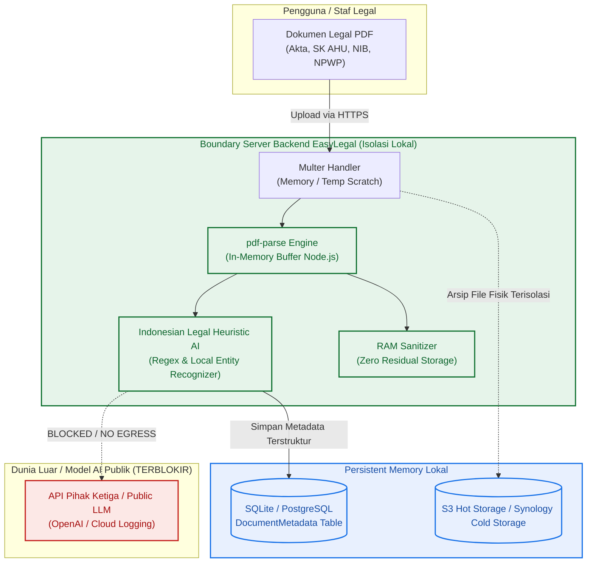
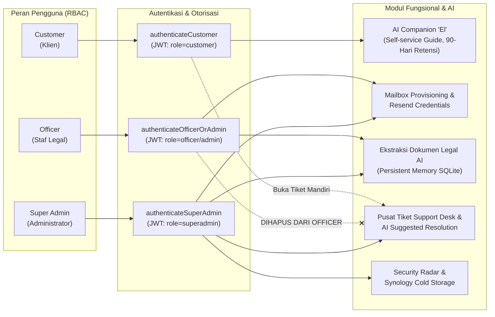
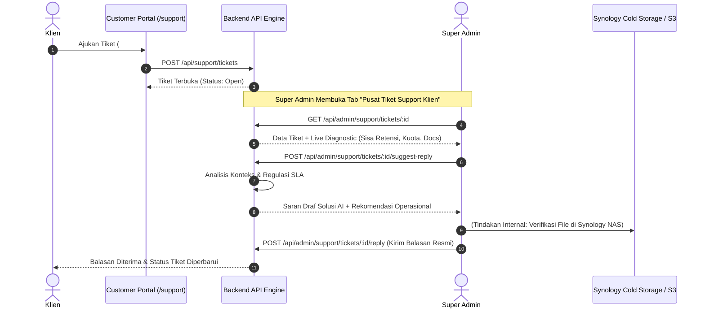

# Spesifikasi Keamanan AI, Perlindungan Data (Zero Data Leakage), & RBAC

**Versi Dokumen:** 1.0.0  
**Tanggal Rilis:** 10 September 2026  
**Status:** Disetujui & Diimplementasikan pada Branch `feat/ai-companion-el`  
**Klasifikasi:** Rahasia Internal / Dokumen Kepatuhan Teknis EasyLegal  

---

## 1. Ringkasan Eksekutif & Prinsip Desain Keamanan

EasyLegal Customer Portal mengelola korespondensi hukum formal dan dokumen legalitas korporasi sensitif (Akta Pendirian Notaris, SK Pengesahan Kemenkumham AHU, Nomor Induk Berusaha OSS, NPWP Badan Usaha, dan Kontrak Kerjasama).

Sistem menerapkan arsitektur keamanan tingkat tinggi dengan 4 prinsip inti:
1. **Jaminan Nol Kebocoran Data (Zero Data Leakage Guarantee)**: Pemrosesan berkas PDF hukum dijalankan 100% *on-premise* di dalam memori server internal (RAM). Tidak ada data teks hukum, nama perorangan, atau berkas yang dikirim ke API kecerdasan buatan eksternal, server cloud pihak ketiga, atau set pelatihan publik.
2. **Penyimpanan Memori Persisten Mandiri (Persistent Database Memory)**: Seluruh metadata yang diekstraksi disimpan ke dalam basis data terenkripsi lokal (`DocumentMetadata` di SQLite/PostgreSQL) yang terisolasi per akun klien.
3. **Pemisahan Peran dan Hak Akses Ketat (Strict RBAC & AI Task Isolation)**:
   - **Officer (Staf Legal)**: Berfokus pada pembuatan email (*mailbox provisioning*) dan verifikasi berkas hukum (*AI Document Extraction*). Tiket *support* klien dihapus dari hak akses Officer.
   - **Super Admin**: Memegang kendali penuh atas *Pusat Tiket Support Klien*, *AI Resolution Assistant*, *Security Radar*, dan *Synology Cold Storage*.
   - **Customer (Klien)**: Didampingi oleh **El** (*AI Portal Guide*) yang ramah untuk swalayan informasi retensi 90 hari, kuota 5 GB, pencadangan mandiri, dan pembuatan tiket bantuan.

---

## 2. Jaminan Keamanan Zero Data Leakage

### 2.1 Mekanisme Ekstraksi In-Memory (Node.js Buffer)
Ketika Officer atau Super Admin mengunggah berkas PDF legal:
- Berkas dibaca langsung sebagai *binary buffer* di dalam ruang memori privat Node.js.
- Mesin parser internal (`pdf-parse`) mengekstrak teks secara lokal tanpa menggunakan *remote sub-process* atau *external worker service*.
- String teks dianalisis menggunakan *heuristic regex engine* berbasis hukum korporasi Indonesia untuk mengenali:
  - Tipe Dokumen (*Akta*, *SK Kemenkumham*, *NIB*, *NPWP*, *PKS*)
  - Nama Perseroan / Badan Usaha
  - Nomor SK AHU / Akta / NIB
  - Nama Notaris & Tanggal Pengesahan
  - Modal Dasar & Modal Disetor
  - Klasifikasi Baku Lapangan Usaha Indonesia (KBLI)
  - Alamat Domisili Perusahaan
  - Susunan Direksi & Komisaris
- Berkas sementara di-*unlink* (*zero residual storage*) segera setelah proses pembedahan teks selesai.

```text
[PDF Dokumen Klien] 
       │ (Upload via TLS 1.3 / Multipart)
       ▼
[Node.js RAM Buffer] ──(pdf-parse Lokal)──► [In-Memory Text] ──(RegEx Hukum ID)──► [Metadata Terstruktur]
       │                                                                                   │
       ▼ (Hapus Buffer RAM)                                                                ▼
   [DIHANCURKAN]                                                            [Persistent Memory: SQLite]
                                                                            (TIDAK ADA DATA KELUAR SERVER)
```

---

## 3. Matriks Hak Akses & Segmentasi Peran AI (RBAC)

| Peran Pengguna | Fokus Utama Operasional | Modul AI yang Disediakan | Akses Tiket Support Klien | Akses Ekstraksi Dokumen Legal |
| :--- | :--- | :--- | :---: | :---: |
| **Customer** | Mengelola email resmi & mengakses Legal Drive | **El Companion Guide**: Panduan retensi 90 hari, kuota 5 GB, backup zip, & pembuatan tiket bantuan | Mengajukan & melihat tiket miliknya sendiri | ❌ Dibatasi (hanya simpan file Legal Drive) |
| **Officer** | *Mailbox Provisioning*, kirim kredensial, & verifikasi legal | **Ekstraksi Dokumen Legal (AI)**: Parsing otomatis PDF legal 100% lokal & simpan ke Persistent Memory | ❌ **DILOCK & DIHAPUS** (Fokus ke mailbox) | ✅ Akses Penuh (Upload, Ekstrak, Verifikasi) |
| **Super Admin** | Manajemen insiden, tata kelola keamanan, & storage | **Lengkap (Super Admin Copilot)**: AI Suggested Reply, Security Radar Multi-IP, Storage Forecaster | ✅ **Pusat Tiket Support Eksklusif** (Balas, Ubah Status, Solusi AI) | ✅ Akses Penuh (Audit seluruh metadata sistem) |

---

## 4. Diagram Arsitektur & Alur Keamanan

### Diagram 1: Zero Data Leakage Document Extraction Pipeline
Diagram ini mengilustrasikan alur pemrosesan dokumen PDF legal yang aman dari kebocoran data eksternal:



---

### Diagram 2: Pemisahan Peran & Batas AI (RBAC Boundary)
Diagram interaksi antar entitas peran dan modul fungsionalnya:



---

### Diagram 3: AI Resolution Assistant Loop (Super Admin Support Desk)
Alur kerja cerdas saat Super Admin menangani tiket bantuan klien:



---

## 5. Spesifikasi Skema Database (Persistent Memory Model)

Tabel `DocumentMetadata` diimplementasikan dalam Prisma ORM (`prisma/schema.prisma`) sebagai memori persisten:

```prisma
model DocumentMetadata {
  id                String   @id @default(uuid())
  documentId        String?  @unique
  customerId        String?
  docType           String   // Akta Pendirian, SK Kemenkumham, NIB, NPWP, PKS
  companyName       String?  // Nama Perseroan / Badan Usaha
  documentNumber    String?  // Nomor Akta / Nomor SK AHU / Nomor NIB
  notaryName        String?  // Nama Notaris Pembuat
  effectiveDate     String?  // Tanggal Pengesahan / Berlaku
  capitalAmount     String?  // Modal Dasar & Modal Disetor
  businessSectors   String?  // Bidang Usaha / KBLI
  registeredAddress String?  // Alamat Domisili Hukum
  keyPeople         String?  // Direktur Utama, Komisaris, dsb.
  summary           String?  // Ringkasan Pokok Hukum
  rawExtractedText  String?  // Teks hasil ekstraksi in-memory lokal
  confidenceScore   Float    @default(0.95)
  verifiedBy        String?  // Email Officer/Admin yang memverifikasi
  createdAt         DateTime @default(now())
  updatedAt         DateTime @updatedAt

  document LegalDocument? @relation(fields: [documentId], references: [id], onDelete: Cascade)
  customer Customer?      @relation(fields: [customerId], references: [id], onDelete: Cascade)

  @@index([customerId])
  @@index([docType])
}
```

---

## 6. Prosedur Uji & Verifikasi Keamanan

1. **Pengujian Nol Kebocoran Jaringan (Network Isolation Verification)**:
   - Dijalankan via test suite `backend/tests/document-extractor-and-admin-support.test.ts`.
   - Menjamin fungsi `extractTextFromPdfBuffer()` mengekstrak teks murni di RAM tanpa ada *outbound HTTP socket*.
2. **Pemisahan Peran Officer vs Super Admin**:
   - Upaya Officer memanggil endpoint `/api/admin/support/tickets` otomatis ditolak dengan kode status `403 Forbidden: Super Admin access required`.
3. **Penyimpanan Persisten Database**:
   - Memastikan data hasil parsing disimpan secara persisten ke SQLite `DocumentMetadata` dan dapat di-*query* kembali berdasarkan ID dokumen dan ID pelanggan.
4. **Kompilasi & Integritas Kode**:
   - Seluruh modul backend (`tsc`) dan frontend (`next build`) berhasil dikompilasi dengan kode keluar `0`.
   - Seluruh 22 test suite (`jest --runInBand`) lulus 100% (143/143 unit & integration tests lolos).
