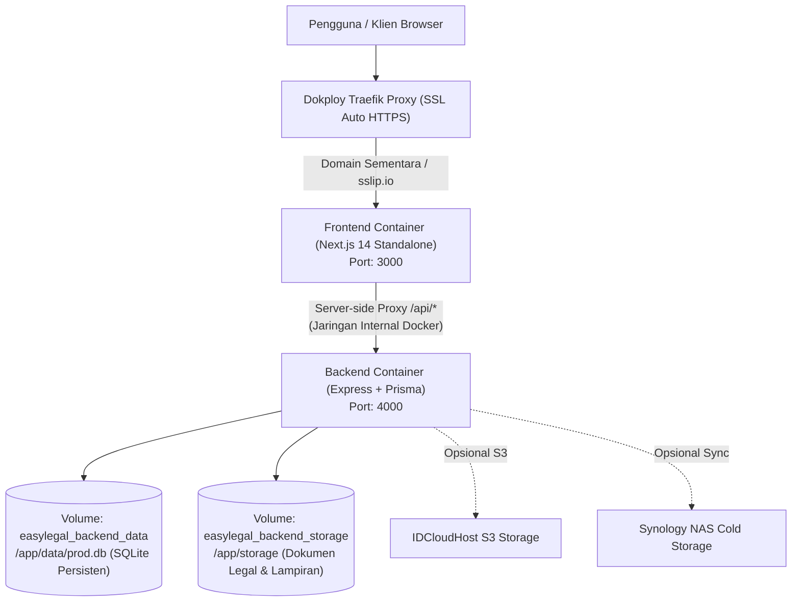

# Panduan Deployment Dokploy — EasyLegal Hub & Email Portal

Panduan ini menjelaskan langkah demi langkah cara men-deploy **EasyLegal Hub & Customer Email Portal** ke **Dokploy** yang beralamat di:  
👉 **`https://panel.easylegal.my.id`**

---

## 🏗️ 1. Arsitektur Deployment di Dokploy



### 🌟 Keunggulan Konfigurasi Ini:
1. **Hanya Butuh 1 Domain / URL Sementara:**  
   Frontend Next.js memiliki built-in rewrite proxy untuk `/api/*` ke `http://backend:4000/*`. Anda tidak perlu membuat 2 domain terpisah untuk frontend dan backend.
2. **Bebas Masalah CORS:**  
   Karena browser hanya berkomunikasi dengan satu origin (Frontend), tidak akan terjadi galat CORS (*Cross-Origin Resource Sharing*) atau perbedaan protokol SSL.
3. **Data Persisten (Anti-Hilang):**  
   Database SQLite dan berkas dokumen tersimpan di Docker Volume bernama (`easylegal_backend_data` dan `easylegal_backend_storage`). Data tetap aman saat container di-restart atau di-redeploy.
4. **Auto-Seed Demo Data Saat Pertama Kali Dijalankan:**  
   Container backend otomatis mendeteksi database baru dan langsung mengisi data demo (Admin, Customer Budi, dan Akun Trial) lengkap dengan berkas PDF/Excel uji coba.

---

## 🚀 2. Langkah-Langkah Deploy di Dashboard Dokploy

### Langkah 1: Buka Panel Dokploy
Buka peramban (browser) Anda dan masuk ke:  
🔗 **`https://panel.easylegal.my.id/dashboard/home`**

---

### Langkah 2: Buat Project Baru
1. Pada menu navigasi sebelah kiri, klik **Projects**.
2. Klik tombol **Create Project** (di pojok kanan atas).
3. Beri nama project, misalnya:  
   `EasyLegal Portal`  
   *(Deskripsi opsional: Customer Email Client & Legal Drive)*
4. Klik **Create**.

---

### Langkah 3: Buat Service Bertipe "Compose"
1. Di dalam project `EasyLegal Portal`, klik tombol **Create Service**.
2. Pilih tipe **Compose**.
3. Beri nama service, misalnya: `mail-portal`.
4. Klik **Create**.

---

### Langkah 4: Hubungkan ke Repositori GitHub
1. Pada halaman konfigurasi service Compose:
   * **Source Type:** Pilih **Git / GitHub**.
   * **Repository:** `Multiverse88/EmailPortal` *(atau pilih dari daftar repo GitHub Anda)*.
   * **Branch:** `feat/ai-companion-el` *(atau `main` jika sudah di-merge)*.
   * **Compose Path:** `docker-compose.dokploy.yml`  
     *(Jika menggunakan compose default tanpa dokploy-network, gunakan `docker-compose.yml`)*.
2. Klik **Save**.

---

### Langkah 5: Pasang Domain Sementara (Opsi 3 - Wildcard / Auto-Generate)
1. Buka tab **Domains** pada service Compose tersebut.
2. Klik tombol **Generate Domain** (atau **Add Domain**).
3. Dokploy akan secara otomatis membuat subdomain wildcard (misal: `mail-portal-xxxx.panel.easylegal.my.id` atau `xxxx.sslip.io`) lengkap dengan sertifikat SSL gratis (*Let's Encrypt Auto HTTPS*).
4. Atur routing domain:
   * **Service:** Pilih `frontend`
   * **Container Port:** `3000`
5. *(Opsional)* Jika Anda juga ingin mengakses API backend secara langsung dari luar:
   * Tambah domain kedua: arahkan ke service `backend`, Container Port `4000`.
6. Klik **Save**.

---

### Langkah 6: Atur Variabel Lingkungan (Environment Variables)
Buka tab **Environment** pada service Compose. Variabel berikut sudah memiliki nilai bawaan yang siap pakai, namun Anda dapat menyesuaikannya:

```env
NODE_ENV=production
HOSTINGER_DOMAIN=clienteasylegal.co.id
JWT_SECRET=super_secret_jwt_key_dokploy_2026
ENCRYPTION_KEY=ganti_dengan_32_karakter_acak_rahasia
CORS_ORIGIN=*
AUTO_SEED_DEMO=true

# Hostinger SMTP (Opsional - untuk notifikasi login perangkat baru)
HOSTINGER_SMTP_HOST=smtp.hostinger.com
HOSTINGER_SMTP_PORT=465
HOSTINGER_SMTP_USER=admin@clienteasylegal.co.id
HOSTINGER_SMTP_PASS=password_smtp_anda

# 9router AI El (Opsional - jika ingin El menggunakan LLM cloud)
NINEROUTER_API_KEY=
```
> [!TIP]
> Generate `ENCRYPTION_KEY` 32-karakter acak dengan menjalankan:  
> `node -e "console.log(require('crypto').randomBytes(32).toString('hex'))"`

Klik **Save**.

---

### Langkah 7: Jalankan Deployment (Deploy)
1. Klik tombol **Deploy** di pojok kanan atas.
2. Dokploy akan menjalankan:
   - Cloning repositori `Multiverse88/EmailPortal` branch `feat/ai-companion-el`.
   - Build image backend (`backend/Dockerfile`).
   - Build image frontend Next.js standalone (`frontend/Dockerfile`).
   - Membuat volume data dan menjalankan healthcheck backend.
   - Mengaktifkan reverse proxy Traefik dengan sertifikat SSL.
3. Anda dapat memantau proses build secara langsung di tab **Deployments** / **Logs**.

---

## 🔑 3. Login & Uji Coba Akun Demo

Setelah status deployment berubah menjadi **Healthy / Running**, klik tautan domain sementara yang dibuat di Langkah 5. Anda dapat langsung menguji portal menggunakan akun bawaan:

### A. Akun Administrator EasyLegal
* **URL:** Buka tab **Administrator** pada layar login (`/login`)
* **Email:** `admin@clienteasylegal.co.id`
* **Password:** `Admin123!`
* **Fitur untuk Dicek:**
  - Pembuatan mailbox baru
  - 1-Click Impersonation (Login sebagai customer)
  - Security Radar multi-IP monitor
  - Master Storage Inspector

### B. Akun Pelanggan (Budi Setiawan - PT Maju Bersama Digital)
* **URL:** Buka tab **Customer Mail** pada layar login (`/login`)
* **Email:** `budi@clienteasylegal.co.id`
* **Password:** `Customer123!`
* **Fitur untuk Dicek:**
  - 21 pesan email dummy (Inbox, Sent, Draf, Trash)
  - Download lampiran fisik nyata (`.pdf`, `.xlsx`, `.png`)
  - Legal Documents Drive (`/documents`) dengan riwayat versi
  - Support Ticket Helpdesk (`/support`)
  - AI Companion El (`/components/companion`) dengan balon ajakan interaktif
  - Fitur 2FA TOTP (Google Authenticator) di Settings (`/settings`)

### C. Akun Pelanggan Trial (14 Hari)
* **Email:** `trial@clienteasylegal.co.id`
* **Password:** `Customer123!`
* **Fitur untuk Dicek:** Email panduan trial, unduh PDF penawaran paket tahunan.

---

## 🛠️ 4. Panduan Troubleshooting

| Gejala / Kendala | Solusi |
|---|---|
| **Build frontend gagal karena memori (OOM)** | Jika VPS memiliki RAM 1GB-2GB, pastikan swap memori aktif di VPS (`swapon --show`). Next.js 14 memerlukan RAM ~1GB saat mengompilasi build. |
| **Pesan 502 Bad Gateway saat pertama kali buka** | Tunggu sekitar 15-30 detik. Backend sedang menjalankan `prisma db push` dan mengisi data demo awal. Cek tab **Logs** container backend. |
| **Ingin mereset database ke kondisi awal demo** | Pada dashboard Dokploy, buka terminal container backend dan jalankan: `npm run seed:demo`. |
| **Ingin beralih ke Domain Resmi Publik di masa depan** | Cukup buka tab **Domains** di Dokploy, ganti domain dengan `mail.clienteasylegal.co.id` dan arahkan A Record DNS domain tersebut ke IP VPS Dokploy Anda. Tidak perlu rebuild! |
