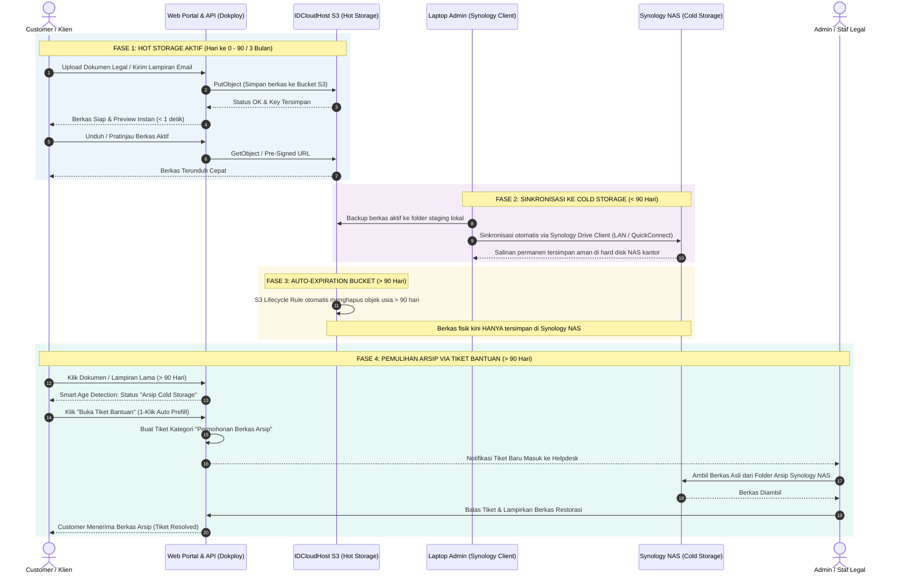
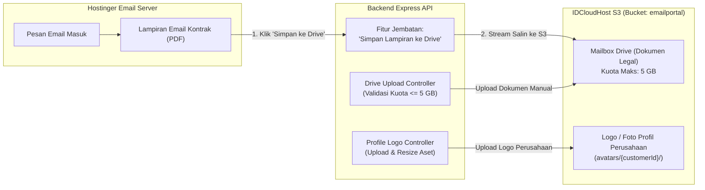

# Arsitektur Infrastruktur & Storage Lifecycle — Email Portal Customer

Dokumen ini menjelaskan arsitektur infrastruktur sistem **Email Portal Customer**, strategi penyimpanan **Hybrid Storage (Hot & Cold Storage)**, estimasi kapasitas serta alur data dari penerimaan dokumen hingga pengarsipan jangka panjang ke Synology NAS tanpa mengubah konfigurasi jaringan lokal kantor.

---

### 1. Ringkasan Eksekutif

| Parameter | Spesifikasi & Strategi |
|---|---|
| **Estimasi Beban** | 1.000 Customer / Bulan |
| **Mail Server (Email)** | Hostinger Cloud Mail (Titan Engine, SMTP 465, IMAP 993, Developers API) |
| **Mailbox Drive (File & Dokumen)** | IDCloudHost Object Storage (S3-Compatible, Bucket `emailportal`) |
| **Batas Kuota Mailbox Drive** | **Maksimal 5 GB / Customer** |
| **Foto Profil / Logo Perusahaan** | IDCloudHost Object Storage (Path S3: `avatars/{customerId}/`) |
| **Penyimpanan Berkas di Hostinger** | **TIDAK** (Hostinger murni menampung pesan email masuk/keluar & lampiran mentah email; berkas Drive & Logo 100% tersimpan di IDCloudHost S3) |
| **Hot Storage (Cloud)** | IDCloudHost Object Storage (S3-Compatible) |
| **Masa Retensi Hot Storage** | 3 Bulan (Rolling Window / Steady-State) |
| **Kapasitas Hot Storage Stabil** | ~150 GB – 250 GB |
| **Cold Storage (On-Premises)** | Synology NAS (Folder Arsip Dokumen Kantor) |
| **Jembatan Sinkronisasi (Bridge)** | Laptop Admin + Synology Drive Client (0 Konfigurasi di NAS/Router) |
| **Biaya Cloud Storage** | Flat ~Rp 80.000 – Rp 140.000 / bulan |
| **Platform Hosting** | Cloud VPS IDCloudHost (Dikelola via Dokploy) |

---

## 2. Diagram Arsitektur Infrastruktur (System Architecture)

Diagram berikut memetakan relasi antara pengguna, server VPS Dokploy di IDCloudHost, Hostinger Mail Cloud, IDCloudHost S3 Object Storage, dan Synology NAS lokal:

```mermaid
flowchart TD
    %% Styling & Classes
    classDef client fill:#EBF5FB,stroke:#2980B9,stroke-width:2px,color:#1B4F72;
    classDef cloud fill:#E8F8F5,stroke:#16A085,stroke-width:2px,color:#0E6251;
    classDef storage fill:#FEF9E7,stroke:#F39C12,stroke-width:2px,color:#7D6608;
    classDef hostinger fill:#FDF2E9,stroke:#E67E22,stroke-width:2px,color:#7E5109;
    classDef local fill:#F4ECF7,stroke:#8E44AD,stroke-width:2px,color:#512E5F;

    subgraph USERS["Public Internet & Pengguna"]
        Customer["Customer / Klien<br/>(Web Browser / Mobile)"]:::client
        Admin["Admin / Legal Staff<br/>(Dashboard Browser)"]:::client
    end

    subgraph HOSTINGER_INFRA["Hostinger Cloud Infrastructure (Mail Server)"]
        HostingerAPI["Developers API v1<br/>(api.hostinger.com)"]:::hostinger
        HostingerSMTP["SMTP Service :465<br/>(smtp.hostinger.com)"]:::hostinger
        HostingerIMAP["IMAP Service :993<br/>(imap.hostinger.com)"]:::hostinger
        HostingerMailbox[("Mailbox Storage<br/>(Pesan Email & Raw Attachment)")]:::hostinger
    end

    subgraph IDCLOUDHOST["IDCloudHost Data Center (Indonesia)"]
        subgraph VPS_DOKPLOY["VPS Dokploy Server"]
            Traefik["Reverse Proxy Traefik<br/>(SSL / Auto HTTPS)"]:::cloud
            Frontend["Frontend Next.js<br/>(Portal UI & Drive Client)"]:::cloud
            Backend["Backend Express.js<br/>(API & Business Logic)"]:::cloud
            Worker["Sync Worker Service<br/>(IMAP / Mail Sync)"]:::cloud
            Postgres[("PostgreSQL DB<br/>(Metadata, Auth & Logs)")]:::cloud
            Redis[("Redis Cache<br/>(Session & Queue)")]:::cloud
        end

        subgraph HOT_STORAGE["IDCloudHost Object Storage (Hot Storage: 0 - 3 Bulan)"]
            S3Drive[("S3: Bucket 'emailportal'<br/>- Mailbox Drive Dokumen (Maks 5 GB/user)<br/>- Logo & Foto Profil Perusahaan<br/>- Cold Buffer Arsip (Total: ~150-250 GB)")]:::storage
        end
    end

    subgraph LOCAL_OFFICE["Lingkungan Kantor / Lokal (Private Network)"]
        subgraph ADMIN_WORKSTATION["Laptop / PC Administrator"]
            ArchiveTool["Archival Tool / Script<br/>(Tarik data > 3 Bulan)"]:::local
            SyncClient["Synology Drive Client<br/>(Background Daemon)"]:::local
            LocalFolder["Local Folder Arsip<br/>(Staging Sinkronisasi)"]:::local
        end

        subgraph SYNOLOGY_ECOSYSTEM["On-Premises Private Storage"]
            NAS["Synology NAS Server<br/>(Cold Storage Permanen)<br/>*0 Konfigurasi Router / No Public IP*"]:::local
        end
    end

    %% Network & User Flows
    Customer -->|HTTPS / Akses Portal & Drive| Traefik
    Admin -->|HTTPS / Akses Admin Console| Traefik
    Traefik --> Frontend
    Traefik --> Backend

    Frontend <--> Backend
    Backend <--> Postgres
    Backend <--> Redis
    Worker <--> Backend

    %% Email Server Flows (Hostinger)
    Admin -->|Provision Mailbox Baru| Backend
    Backend -->|1. Auto Provision Mailbox| HostingerAPI
    Backend -->|2. Kirim Email Customer| HostingerSMTP
    Worker -->|3. Sinkronisasi Pesan Masuk| HostingerIMAP
    HostingerSMTP --> HostingerMailbox
    HostingerIMAP <--> HostingerMailbox

    %% Object Storage Flows (IDCloudHost S3)
    Backend -->|4. Upload / Unduh Dokumen Drive & Logo (Maks 5 GB)| S3Drive
    Backend -.->|5. Bridge: 'Simpan Lampiran ke Drive'| S3Drive

    %% Archival Flows (Synology NAS)
    ArchiveTool -.->|6. Download Arsip Berkala > 90 Hari| S3Drive
    ArchiveTool -.->|Simpan File Lama| LocalFolder
    LocalFolder <--> SyncClient
    SyncClient ==|7. Otomatis Sync via QuickConnect / LAN|==> NAS
    ArchiveTool -.->|8. Purge File Lama dari S3| S3Drive
```

---

## 3. Diagram Alur Siklus Dokumen & Retensi (Data Lifecycle)

Alur berkas dari saat diunggah customer, disimpan di Hot Storage S3 selama 90 hari, otomatis dihapus oleh S3 Native Lifecycle, hingga mekanisme pemulihan berkas arsip dari Synology NAS melalui Tiket Bantuan:



---

## 4. Rincian Komponen Infrastruktur

### A. Compute & Platform Layer (IDCloudHost VPS)
* **Dokploy PaaS**: Berfungsi sebagai orkestrator kontainer (Docker) mandiri di VPS untuk mengelola database, redis, backend, dan frontend secara otomatis.
* **Traefik Reverse Proxy**: Menangani routing domain (`mail.clienteasylegal.co.id`), rate limiting, dan auto-renewal sertifikat SSL Let's Encrypt.
* **Backend & Worker**: Menjalankan Node.js untuk menangani REST API, IMAP sync dengan Hostinger, adapter S3, dan deteksi usia berkas (Smart Age Detection).
* **Database (PostgreSQL)**: Menyimpan metadata dokumen (nama file, hash, ukuran, relasi user, timestamp asli), bukan file fisik biner.

### B. Mail Server Layer (Hostinger Cloud Mail)
* **Standard**: SMTP (Port 465 SSL), IMAP (Port 993 SSL), dan Hostinger Developers REST API (`https://api.hostinger.com/v1/email`).
* **Fungsi**: 
  * Menangani pengiriman email langsung melalui kredensial masing-masing customer (`smtp.hostinger.com`).
  * Menyinkronkan kotak masuk (Inbox), email terkirim, draf, dan folder IMAP pelanggan (`imap.hostinger.com`).
  * Auto-provisioning mailbox baru melalui API Hostinger saat admin mendaftarkan klien.
* **Tanggung Jawab Data**: **HANYA** menyimpan data pesan email (body HTML, subject, headers) dan berkas yang menempel langsung sebagai *attachment* email mentah.
* **Penegasan**: Hostinger Email **TIDAK** memiliki fungsi file drive/repositori, sehingga **TIDAK menyimpan dokumen Mailbox Drive maupun foto profil/logo korporat**.

### C. Hot Storage Layer (IDCloudHost Object Storage S3)
* **Standard**: S3-Compatible API (`https://is3.cloudhost.id`, Bucket: `emailportal`).
* **Fungsi**: 
  * **Mailbox Drive (Legal Documents)**: Menampung seluruh berkas digital korporasi (akta pendirian, kontrak, SK Kemenkumham, invoice) dengan batasan kuota **maksimal 5 GB per akun customer**.
  * **Aset Logo & Profil**: Menampung foto profil / logo resmi perusahaan klien (`avatars/{customerId}/`) dalam format PNG/JPG/WebP/SVG (maks 3 MB).
  * **Lampiran Email yang Disimpan ke Drive**: Lampiran email yang disalin oleh customer via fitur *"Simpan ke Drive"* dialihkan ke S3 agar tidak memakan kuota email Hostinger.
* **Keunggulan**:
  * **Zero VPS Disk Bloat**: Hard disk SSD VPS tetap bersih dan bebas dari beban berkas berukuran gigabyte.
  * **Intranet Speed**: Karena VPS Dokploy dan S3 berada di dalam satu data center IDCloudHost (Indonesia), transfer berkas berlatensi ultra-rendah (< 2 ms).
  * **Struktur Prefix S3 Terisolasi**:
    * `documents/{customerId}/` — Repositori dokumen Mailbox Drive.
    * `avatars/{customerId}/` — Foto profil dan logo perusahaan klien.
    * `attachments/{customerId}/` — Lampiran email yang dialihkan ke cloud drive.
  * **Auto Purge via Lifecycle**: Menggunakan Native S3 Lifecycle Rule untuk otomatis mengeliminasi berkas berumur > 90 hari setelah dicadangkan ke NAS.

### D. Cold Storage Layer (Synology NAS & Drive Client)
* **Fungsi**: Arsip permanen jangka panjang untuk keperluan audit hukum dan retensi data bertahun-tahun.
* **Mekanisme Bridge**:
  * Menggunakan **Synology Drive Client** yang terpasang di komputer/laptop administrator.
  * Tidak memerlukan pembukaan port router (Port Forwarding), tidak memerlukan IP publik statis di kantor, dan tidak memerlukan instalasi aplikasi tambahan di DSM NAS.
  * Laptop bertindak sebagai agen transisi: file yang ditarik dari S3 langsung dimasukkan ke folder sinkronisasi Synology, lalu ditransfer ke NAS secara aman melalui jalur terenkripsi Synology QuickConnect atau WiFi LAN lokal.

---

## 5. Pemisahan Peran Penyimpanan: Hostinger vs IDCloudHost

Bagian ini menegaskan batas arsitektur antara layanan **Hostinger Cloud Mail** dan **IDCloudHost Object Storage (S3)** untuk mencegah ambiguitas penempatan berkas dalam sistem:

### 5.1 Apakah Berkas Dokumen & Logo Tersimpan di Hostinger?

> [!IMPORTANT]
> **Jawabannya: TIDAK.** 
> Berkas dokumen (Mailbox Drive) dan foto profil / logo korporasi **SAMA SEKALI TIDAK TERSIMPAN DI SERVER HOSTINGER**.
> Seluruh berkas tersebut **100% murni tersimpan di IDCloudHost Object Storage S3** (Bucket: `emailportal`).

#### Alasan Teknis & Arsitektural:
1. **Hostinger Murni Layanan Mail Server**:
   Hostinger Email Hosting hanya menyediakan protokol IMAP/SMTP/POP3 dan antarmuka webmail. Hostinger tidak menyediakan API Object Storage (seperti S3 atau Google Drive API) untuk menyimpan berkas aplikasi atau repositori folder dinamis.
2. **Perlindungan Kuota Email**:
   Jika dokumen korporasi (kontrak, akta ratusan MB) dipaksakan masuk ke server email Hostinger, kuota email akan sangat cepat habis (*quota exceeded*), yang dapat menyebabkan email penting dari pihak eksternal gagal masuk (*bounce*).
3. **Kecepatan & Kedaulatan Data Lokal**:
   IDCloudHost S3 berlokasi di data center Indonesia, menghasilkan latensi sangat rendah untuk pratinjau (*preview*) dokumen instan dan unduh berkas biner, serta sepenuhnya mematuhi UU Pelindungan Data Pribadi (UU PDP).

---

### 5.2 Matriks Perbandingan & Pembagian Tanggung Jawab

| Kategori / Parameter | Hostinger Email Hosting | IDCloudHost Object Storage (S3) |
|---|---|---|
| **Peran Utama** | Mail Server Korporasi (Kirim/Terima Surat) | Repositori Dokumen Legal & Aset Portal |
| **Protokol Komunikasi** | SMTP (`:465`), IMAP (`:993`), REST API | S3 REST API (AWS Signature V4, HTTPS) |
| **Data yang Disimpan** | Pesan email (HTML/Text), subject, mailbox folder, attachment mentah email | File PDF dokumen legal, DOCX, scan identitas, foto profil / logo perusahaan |
| **Penyimpanan Mailbox Drive** | ❌ **Tidak Ada** |  **100% Tersimpan (Bucket: `emailportal`)** |
| **Penyimpanan Logo Perusahaan** | ❌ **Tidak Ada** |  **100% Tersimpan (Prefix: `avatars/`)** |
| **Alokasi Batas Kuota** | Kuota bawaan paket Hostinger Email | **Maksimal 5 GB per Akun Customer** |
| **Masa Retensi Data** | Permanen di server Hostinger (selama kuota cukup) | Hot Tier 90 hari $\rightarrow$ Cold Tier Synology NAS |
| **Konektivitas ke Portal** | NodeMailer (SMTP) + ImapFlow (IMAP) | AWS SDK `@aws-sdk/client-s3` |

---

### 5.3 Mekanisme Bridging (Konektivitas Antar-Layanan)

Meskipun disimpan di dua penyedia infrastruktur yang berbeda, portal menghubungkan keduanya secara mulus (*seamless bridging*):



#### Alur Kerja Jembatan (*Bridge Workflow*):
1. **Alur Email Standar**: Customer membaca dan mengirim email melalui protokol Hostinger IMAP & SMTP.
2. **Alur Mailbox Drive & Logo**: Customer mengunggah berkas dokumen legal di menu `/documents` atau memperbarui logo korporat di `/settings?tab=profile`. Backend memvalidasi ukuran dan menyimpannya langsung ke IDCloudHost S3.
3. **Alur "Simpan Lampiran ke Drive"**: Ketika email masuk berisi lampiran penting (misal: kontrak kerja sama atau bukti bayar), customer cukup menekan tombol *"Simpan ke Drive"*. Backend akan membaca stream berkas dari pesan email Hostinger dan menyalinnya ke bucket S3 IDCloudHost, sekaligus mencatatnya ke repositori dokumen resmi customer tanpa menghabiskan kuota email Hostinger.

---

### 5.4 Kebijakan Kuota 5 GB & Pengelolaan Logo Perusahaan

1. **Batas Kuota Mailbox Drive (5 GB)**:
   * Setiap akun customer dialokasikan ruang penyimpanan Mailbox Drive sebesar **5 GB** (`5 * 1024 * 1024 * 1024` byte) pada bucket IDCloudHost S3.
   * **Validasi Sisi Server (Backend)**: Sebelum file diunggah ke S3, backend menghitung akumulasi total kapasitas berkas yang sudah digunakan oleh customer. Jika penambahan file baru melebihi 5 GB, server menolak permintaan dengan kode HTTP `413 Payload Too Large` beserta pesan: *"Kapasitas penyimpanan Mailbox Drive Anda telah mencapai batas maksimal (5 GB)."*
   * **Visualisasi Sisi Klien (Frontend)**: Halaman Dokumen (`/documents`) dan Pengaturan (`/settings`) menampilkan indikator kapasitas penyimpanan dinamis (progress bar) berbasis 5 GB secara transparan.

2. **Pengunggahan Logo Perusahaan di Menu Pengaturan (`/settings?tab=profile`)**:
   * Customer dapat mengunggah logo resmi perusahaan untuk personalisasi identitas bisnis.
   * Aset disimpan ke S3 dengan format: `avatars/{customerId}/logo_{timestamp}.[png|jpg|webp|svg]`.
   * Logo yang berhasil diunggah otomatis diintegrasikan dan ditampilkan pada:
     - Header aplikasi utama ([`SuiteHeader`](file:///home/fullstackiteasylegal/Documents/Email%20Portal%20Customer/frontend/src/components/suite-header.tsx)) menggantikan inisial nama.
     - Kartu identitas profil perusahaan di menu Pengaturan.
     - Pratinjau dokumen legal korporat.

---

## 6. Analisis Kapasitas & Estimasi Biaya

### Proyeksi Kapasitas (1.000 Pengguna / Bulan)

* **Rata-rata Dokumen**: ~15–20 berkas/dokumen per customer per bulan.
* **Rata-rata Ukuran Dokumen**: ~3 MB – 5 MB (gabungan surat teks, PDF resmi, dan lampiran scan).
* **Akumulasi per User**: ~75 MB / customer.

$$\text{Kebutuhan Bulanan} = 1.000 \times 75\text{ MB} = 75\text{ GB / Bulan}$$

Dengan kebijakan **Rolling Window 3 Bulan**:

$$\text{Steady-State Storage S3} = 75\text{ GB} \times 3 = \mathbf{225\text{ GB}}$$

### Estimasi Biaya Bulanan

| Komponen | Spesifikasi | Estimasi Biaya / Bulan |
|---|---|---|
| **Object Storage S3** | IDCloudHost (225 GB @ Rp 507/GB) | ~Rp 114.000 |
| **VPS Server (Dokploy)** | 2 vCPU, 4 GB RAM, 40-50 GB SSD | ~Rp 150.000 – Rp 200.000 |
| **Cold Storage (NAS)** | Synology Drive On-Premises | **Rp 0** (Hardware sudah dimiliki) |
| **Total Estimasi** | Infrastruktur Full Cloud + Hot Storage | **~Rp 264.000 – Rp 314.000 / bulan** |

> **Catatan:** Setelah bulan ke-3, tagihan Object Storage akan terkunci stabil (flat) karena dokumen lama yang berumur > 90 hari dipindahkan ke NAS dan dihapus dari S3 oleh aturan lifecycle otomatis.

---

## 7. Aspek Keamanan & Kepatuhan Regulasi

1. **Kedaulatan Data (UU Pelindungan Data Pribadi / PDP)**:
   * Seluruh data aktif tersimpan di pusat data lokal Indonesia (IDCloudHost Data Center).
2. **Isolasi Jaringan NAS Kantor**:
   * NAS kantor tidak dibuka ke internet publik, menghilangkan risiko serangan brute-force, ransomware, atau scanning port dari peretas luar.
3. **Enkripsi End-to-End**:
   * Komunikasi Web ke VPS: HTTPS (TLS 1.3).
   * Komunikasi VPS ke S3: S3 HTTPS API dengan Signature V4.
   * Komunikasi Laptop ke NAS: Enkripsi SSL bawaan Synology Drive Client.

---

## 8. Kebijakan Retensi 3 Bulan & Integrasi Tiket Bantuan (Cold Storage Restore)

### 8.1 Kebijakan S3 Native Lifecycle Rule (90 Hari)
Bucket S3 IDCloudHost (`emailportal`) dikonfigurasi dengan aturan siklus hidup (lifecycle policy) resmi Ceph S3:
* **Target Bucket**: `emailportal`
* **Filter Prefix**: `attachments/` dan `documents/` (atau seluruh objek dalam bucket)
* **Status**: `Enabled`
* **Action**: `Expiration -> Days: 90`

#### Konfigurasi XML S3 Lifecycle:
```xml
<LifecycleConfiguration>
    <Rule>
        <ID>AutoExpireColdStorageAfter90Days</ID>
        <Filter>
            <Prefix></Prefix>
        </Filter>
        <Status>Enabled</Status>
        <Expiration>
            <Days>90</Days>
        </Expiration>
    </Rule>
</LifecycleConfiguration>
```
*Aturan ini dapat diaplikasikan melalui AWS CLI (`aws s3api put-bucket-lifecycle-configuration --endpoint-url https://is3.cloudhost.id`) atau menu S3 Management di Dokploy / Web Console IDCloudHost.*

---

### 8.2 Backend Smart Age Detection (Deteksi Usia Cerdas)
Untuk mencegah error `404 Not Found` saat customer mencoba mengunduh file yang sudah dibersihkan oleh S3 setelah 90 hari:

1. **Kalkulasi Usia Berkas**:
   ```typescript
   const RETENTION_DAYS = 90;
   const fileAgeInDays = Math.floor((Date.now() - new Date(fileRecord.createdAt).getTime()) / (1000 * 60 * 60 * 24));
   const isArchived = fileAgeInDays > RETENTION_DAYS;
   ```
2. **Respon Metadata Berkas**:
   Ketika API merespons daftar dokumen (`/api/documents`) atau detail lampiran email:
   ```json
   {
     "id": "doc_12345",
     "fileName": "Akta_Pendirian_PT.pdf",
     "fileSize": "2.4 MB",
     "createdAt": "2026-05-10T08:00:00.000Z",
     "fileAgeDays": 122,
     "isArchived": true,
     "storageTier": "COLD_STORAGE",
     "archiveLocation": "Synology NAS Kantor",
     "restoreAction": {
       "type": "OPEN_SUPPORT_TICKET",
       "targetUrl": "/support?action=restore_archive&documentId=doc_12345"
     }
   }
   ```
3. **Pencegahan Akses Langsung**:
   Jika endpoint `/api/documents/:id/download` dipanggil untuk file berusia > 90 hari, backend tidak akan memanggil S3 `GetObject`, melainkan mengembalikan response HTTP `410 Gone` atau `200 OK` dengan status terarah:
   `"Berkas telah dialihkan ke cold storage kantor. Silakan ajukan permohonan pemulihan melalui tiket bantuan."`

---

### 8.3 Pengalaman Pengguna (UI/UX) & 1-Klik Buka Tiket
Di portal frontend (`/documents` dan `/inbox`):

1. **Indikator Status (Badge)**:
   * Berkas < 90 hari: Badge hijau `"Tersedia di Cloud"` dengan tombol **Unduh** & **Pratinjau**.
   * Berkas > 90 hari: Badge amber/kuning `"Arsip Cold Storage (> 3 Bulan)"`.
2. **Tombol Tindakan 1-Klik**:
   * Tombol biasa otomatis berganti menjadi **"Minta Berkas (Tiket Bantuan)"**.
3. **Formulir Tiket Terisi Otomatis (*Pre-filled Ticket Form*)**:
   Saat tombol diklik, portal langsung membuka halaman Tiket Bantuan (`/support`) dengan field yang sudah otomatis terisi:
   * **Kategori**: `Permohonan File Arsip (Cold Storage)`
   * **Subjek**: `[Permohonan Berkas Arsip] Akta_Pendirian_PT.pdf`
   * **Prioritas**: `Sedang`
   * **Deskripsi Tiket**:
     ```text
     Halo Tim Support EasyLegal,

     Saya memerlukan salinan berkas yang telah melewati masa retensi 3 bulan berikut:
     - Nama Berkas: Akta_Pendirian_PT.pdf
     - ID Dokumen: doc_12345
     - Tanggal Unggah: 10 Mei 2026 (Usia: 122 hari)
     - Ukuran: 2.4 MB

     Mohon dibantu restorasi dari arsip Synology NAS kantor. Terima kasih.
     ```

---

### 8.4 Struktur Folder Synology NAS Berbasis Akun (Per-Account Isolation)

Untuk memastikan berkas klien **mudah dicari saat dibutuhkan**, seluruh berkas yang disinkronkan ke Synology NAS otomatis tersimpan dalam folder khusus untuk masing-masing akun customer:

```text
EmailPortal_ColdStorage/
└── accounts/
    ├── PT SINAR JAYA (ptsinarjaya@clienteasylegal.co.id)/
    │   ├── account-info.json            <-- Profil akun, status, dan kuota 5 GB
    │   ├── avatar/                      <-- Foto profil / Logo perusahaan
    │   │   └── logo.png
    │   ├── documents/                   <-- Dokumen legal (nama asli berkas)
    │   │   ├── akta-pendirian-pt.pdf
    │   │   └── sk-kemenkumham-2026.pdf
    │   └── attachments/                 <-- Lampiran email masuk & keluar
    │       └── invoice-pembayaran.pdf
    ├── Budi Setiawan (budi@clienteasylegal.co.id)/
    │   ├── account-info.json
    │   ├── documents/
    │   └── attachments/
    └── .sync-manifest.json              <-- Riwayat & checksum sinkronisasi
```

#### Keunggulan Arsitektur Folder per Akun di Synology:
1. **Pencarian Cepat & Intuitif**:
   Staf legal atau admin cukup mengetikkan **Nama Perusahaan** (misal *"Sinar Jaya"*) atau **Alamat Email** (misal *"ptsinarjaya@clienteasylegal.co.id"*) pada kotak pencarian Synology Drive / File Station, dan folder akun langsung ditemukan seketika.
2. **Nama Berkas Asli & Bersih**:
   Dokumen dan lampiran tidak lagi disimpan dengan UUID acak, melainkan menggunakan nama berkas asli yang diunggah pengguna (misal: `akta-pendirian-pt.pdf`), sehingga staf kantor dapat langsung membaca dan membuka dokumen tanpa perlu mengonversi kode ID.
3. **Pemisahan Antar-Akun Mutlak (Zero-Cross Leakage)**:
   Setiap akun memiliki direktori mandiri. Berkas dari akun A tidak akan pernah tercampur dengan berkas dari akun B di dalam NAS kantor.
4. **Metadata Profil Otomatis (`account-info.json`)**:
   Setiap folder akun dilengkapi catatan JSON berisi informasi resmi pelanggan: nama akun, email terdaftar, kuota penyimpanan (5 GB), dan timestamp sinkronisasi terakhir.

---

### 8.5 Standard Operating Procedure (SOP) Admin: Pemulihan dari Synology NAS
1. **Penerimaan Tiket**: Staf Admin/Legal menerima notifikasi tiket baru di modul Helpdesk (`/support`).
2. **Pencarian Berkas di NAS**:
   * Admin membuka folder Synology Drive di laptop/PC kantor:
     `SynologyDrive/EmailPortal_ColdStorage/accounts/[Nama Perusahaan] ([Email])/documents/[Nama Dokumen]`
     Contoh:
     `SynologyDrive/EmailPortal_ColdStorage/accounts/PT SINAR JAYA (ptsinarjaya@clienteasylegal.co.id)/documents/akta-pendirian-pt.pdf`
3. **Pengiriman ke Customer**:
   * Admin mengunggah kembali file tersebut langsung ke kolom balasan tiket bantuan sebagai lampiran pemulihan resmi.
   * Admin mengirim pesan konfirmasi: *"Berkas Anda telah berhasil dipulihkan dari arsip Synology NAS kantor kami."*
4. **Penyelesaian Tiket**: Admin mengubah status tiket menjadi **Resolved**.

