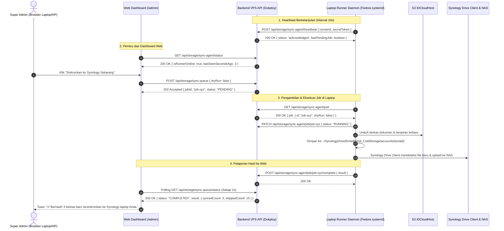

# Design Spec: Super Admin Synology Laptop Sync Runner

## 1. Overview & Problem Statement

### 1.1 Background
Portal EasyLegal saat ini berjalan di cloud VPS (Dokploy) pada domain `clienteasylegal.co.id`, dan menyimpan dokumen serta lampiran di Hot Storage S3 IDCloudHost (`is3.cloudhost.id`).
Sementara itu, arsip permanen (Cold Storage) berada di **Synology NAS kantor**, yang terhubung melalui aplikasi desktop **Synology Drive Client** di laptop admin Fedora pada path:
`/home/fullstackiteasylegal/SynologyDrive/EmailPortal_ColdStorage`.

### 1.2 Objective
Memberikan kemampuan kepada **Super Admin** untuk memicu sinkronisasi arsip ke folder Synology Drive di laptop kerjanya langsung dari tombol antarmuka web dashboard (`https://clienteasylegal.co.id/admin`), dengan ketentuan:
1. **Trigger tetap berada di web dashboard akun Super Admin**.
2. **Eksekusi fisik penyalinan berkas dilakukan khusus di laptop Fedora Super Admin**, di mana Synology Drive Client terpasang.
3. **Runner di laptop berjalan secara hening dan otomatis di latar belakang** menggunakan Fedora `systemd --user` service saat laptop dinyalakan.
4. **Web dashboard menampilkan status koneksi live laptop**:
   - Hijau (`Online`): Tombol sinkronisasi aktif.
   - Abu-abu (`Offline`): Tombol dinonaktifkan dengan keterangan bahwa laptop sedang mati/offline (misal saat web dibuka dari smartphone).

---

## 2. Architecture & Data Flow



---

## 3. Backend API Components (`backend/src/routes/storage.ts`)

Semua endpoint di bawah ini diproteksi secara ketat:
- Endpoint untuk Super Admin di web dilindungi middleware `authenticateSuperAdmin`.
- Endpoint untuk Runner di laptop dilindungi header `X-Runner-Secret-Token` yang mencocokkan `process.env.SYNOLOGY_RUNNER_TOKEN`.

### 3.1 Data Structures (In-Memory Queue with Persistence)
```typescript
interface SyncJob {
  id: string;
  requestedBy: string;
  status: 'PENDING' | 'RUNNING' | 'COMPLETED' | 'FAILED' | 'EXPIRED';
  dryRun: boolean;
  createdAt: Date;
  startedAt?: Date;
  completedAt?: Date;
  result?: {
    syncedCount: number;
    skippedCount: number;
    failedCount: number;
    totalBytesCopied: number;
    errors: Array<{ path: string; error: string }>;
  };
  errorMessage?: string;
}

interface RunnerHeartbeatState {
  lastHeartbeat: Date | null;
  runnerHost: string | null;
  targetDir: string | null;
  version: string | null;
}
```

### 3.2 Endpoints Spec
1. `GET /api/storage/sync-agent/status`:
   - Auth: `authenticateAdmin` / `authenticateSuperAdmin`
   - Output: `{ isOnline: boolean, lastSeenSecondsAgo: number, activeJob: SyncJob | null }`
   - Kriteria Online: `lastHeartbeat` tercatat kurang dari 25 detik yang lalu.

2. `POST /api/storage/sync-queue`:
   - Auth: `authenticateSuperAdmin`
   - Body: `{ dryRun?: boolean }`
   - Logic: Menolak jika runner offline (400) atau jika sudah ada job yang sedang `RUNNING` (409). Membuat `jobId` unik dengan status `PENDING`.
   - Output: `{ success: true, jobId: string, message: string }`

3. `GET /api/storage/sync-queue/status/:jobId`:
   - Auth: `authenticateSuperAdmin`
   - Output: Status progres terkini dari job tersebut.

4. `POST /api/storage/sync-agent/heartbeat`:
   - Auth: `X-Runner-Secret-Token`
   - Body: `{ hostname: string, targetDir: string, syncedCount: number }`
   - Output: `{ acknowledged: true, hasPendingJob: boolean }`

5. `GET /api/storage/sync-agent/poll`:
   - Auth: `X-Runner-Secret-Token`
   - Output: Mengembalikan job pertama dengan status `PENDING`, lalu mengubah statusnya menjadi `RUNNING`.

6. `POST /api/storage/sync-agent/complete`:
   - Auth: `X-Runner-Secret-Token`
   - Body: `{ jobId: string, success: boolean, result?: any, error?: string }`
   - Output: `{ acknowledged: true }`

---

## 4. Laptop Local Runner Daemon (`backend/scripts/sync-agent.ts`)

### 4.1 Deskripsi
Skrip TypeScript mandiri yang berjalan sebagai proses daemon di laptop Fedora admin.
Memanfaatkan class `SynologySyncService` yang sudah ada (`backend/src/lib/synology-sync.ts`) untuk melakukan sinkronisasi file dari S3 ke disk lokal laptop.

### 4.2 Siklus Kerja Runner:
1. Membaca variabel konfigurasi dari `backend/.env` (atau argumen CLI):
   - `BACKEND_API_URL`: `https://clienteasylegal.co.id`
   - `SYNOLOGY_RUNNER_TOKEN`: Secret token yang sama dengan di Dokploy.
   - `SYNOLOGY_DIR`: `/home/fullstackiteasylegal/SynologyDrive/EmailPortal_ColdStorage`
2. Menjalankan *heartbeat loop* setiap 10 detik.
3. Saat respons heartbeat mengindikasikan `hasPendingJob: true`:
   - Memanggil `GET /api/storage/sync-agent/poll`.
   - Menjalankan `syncService.sync({ dryRun })`.
   - Mengirim laporan hasil ke `POST /api/storage/sync-agent/complete`.

---

## 5. Fedora Systemd Service (`easylegal-synology-runner.service`)

Dikonfigurasi sebagai **Systemd User Service** (`~/.config/systemd/user/easylegal-synology-runner.service`), sehingga:
- Tidak membutuhkan akses `sudo` / root.
- Otomatis dijalankan saat pengguna `fullstackiteasylegal` login/booting.
- Otomatis restart jika terjadi error atau jaringan terputus sementara.

### 5.1 Definisi Unit File:
```ini
[Unit]
Description=EasyLegal Synology Drive Cold Storage Runner
After=network.target

[Service]
Type=simple
WorkingDirectory=/home/fullstackiteasylegal/Documents/Email Portal Customer
ExecStart=/usr/bin/npm --prefix backend run storage:agent
Restart=always
RestartSec=10
Environment=NODE_ENV=production

[Install]
WantedBy=default.target
```

---

## 6. Antarmuka Web Dashboard Super Admin (`frontend/src/app/admin/page.tsx`)

### 6.1 State & Komponen UI
1. **Status Badge Runner Laptop**:
   - `🟢 Laptop Terhubung (Synology Drive Online)` jika runner aktif.
   - `⚪ Laptop Offline (Synology Drive Tidak Aktif)` jika runner mati.
2. **Tombol Trigger**:
   - Teks normal: **"Sinkronkan ke Synology Sekarang"**.
   - Saat proses: Animasi putar dengan teks **"Menyinkronkan ke Laptop..."**.
   - Disabled state jika laptop offline, dengan tooltip penjelas.
3. **Feedback Visual**:
   - Toast dialog hijau saat sinkronisasi sukses: menampilkan jumlah berkas baru yang berhasil disalin.

---

## 7. Verifikasi & Kriteria Keberhasilan

1. **Unit Test API**: Endpoint heartbeat, queue, poll, dan complete berjalan dengan status kode HTTP yang tepat.
2. **Pengujian Runner**: Runner di laptop mendeteksi job dari VPS dan menyalin berkas dummy/nyata ke folder target.
3. **Pengujian UI**:
   - Saat service laptop menyala, UI web di `https://clienteasylegal.co.id/admin` menunjukkan status hijau.
   - Klik tombol memicu proses dan menampilkan toast sukses setelah selesai.
4. **Verifikasi Systemd**: Service `systemctl --user status easylegal-synology-runner` berstatus `active (running)`.
